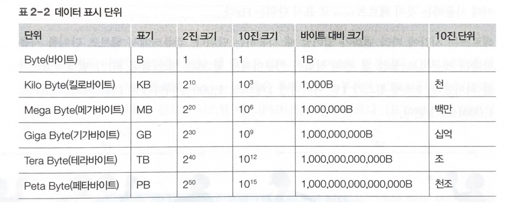

## ✅ 하드웨어의 구성

- **중앙처리장치(CPU):** 연산을 담당, 컴퓨터 프로그램 실행에 있어서 핵심이 되는 장치
- **메인 메모리:** 프로그램과 데이터를 일시적으로 저장하는 장치, CPU가 빠르게 접근할 수 있는 임시 저장소
- **입력장치:** 사용자로부터 데이터를 컴퓨터 내부로 전달하는 장치로 키보드, 마우스 등이 해당
- **출력장치:** 컴퓨터에서 처리된 결과를 사용자가 인식할 수 있는 형태로 변환하여 전달 하는 장치로 모니터, 프린터 등이 해당
- **저장장치:** 데이터와 프로그램을 영구적으로 보관하는 장치로, 하드 디스크 SSD 등이 대표적

---

## ✅ 폰노이만 구조 (Von Neumann Architecture)

> **모든 프로그램은 메모리에 올라와야 실행할 수 있다.
현대 컴퓨터의 기본이 되는 아키텍처**
>

---

## 🆗기초 용어 정리

**◼️ 크기 단위**

**⏲ 클록과 헤르츠**

- **클록(Clock)**
  - **CPU가** 작업을 수행하는 속도를 결정하는 신호.
  - 클록 주파수가 높을수록 연산 속도가 빠름
- **헤르츠(Hz, Hertz)**
  - 1 Hz = 1초에 1번 신호
  - 1 GHz =  1 X 10⁹ = 10억

  💡 **예시**

  CPU가 **3.5 GHz** → 초당 35억 번 연산 가능

**🚐 시스템버스와 CPU 버스**

- CPU, 메모리, I/O 장치 간 데이터 이동을 담당하는 **중앙 버스**
- **시스템 버스 (FSB)** Front-side Bus  전면버스

  > 세가지 종류
  >
  - 데이터 버스 → **데이터 전송**
    - 메모리 버퍼 레지스터와 연결된 버스로, 데이터 이동이 양방향으로 이루어진다.
  - 주소 버스 → **메모리 주소 지정**
    - 메모리 주소 레지스터와 연결된 버스로, 데이터를 읽거나 쓸 때 메모리나 주변장치에 위치정보를 보내기 위해 사용하며 단방향이다.
  - 제어 버스 → **제어 신호 전달**
    - 제어 장치와 연결된 버스로 CPU가 메모리와 주변장치에 제어신호를 보내기위해 사용한다.
- **CPU 버스**
  - CPU 내부에서 사용되는 **고속 전용 버스**

시스템 버스가 “고속도로”라면, CPU 버스는 “전용 차선”

## ✅ CPU 와 메모리

> CPU는 명령어를 해석하여 실행하는 장치 e.g) 요리사
산술논리 연산장치, 제어장치, 레지스터로 구성되며 이것들의 협업으로 작업을 처리한다.
>

🧭 **산술논리 연산장치 (ALU)**

- CPU 가 데이터를 연산하는 장치 e.g) 덧셈, 뺄셈, 곱셈 나눗셈

**🎛️ 제어장치**

- CPU에서 작업을 지시하는 부분을 제어장치

🏠 **레지스터**

- 작업에 필요한 데이터를 CPU 내부에 보관하는 곳이 레지스터(register)
  - 작업을 진행하기 위해 필요한 정보를 보관
  - 계산을 하기위해 가져온 데이터를 저장, 계산의 중간값 임시 보관

**▶️ 레지스터 종류**

- **데이터 레지스터:** 메모리에서 가져온 데이터 임시 보관, CPU 대부분이 레지스터가 데이터 레지스트라서 일반OR범용 레지스터라고 부른다.
- **주소 레지스터:** 데이터 또는 명령어가 저장된 메모리의 주소는 주소 레지스터에 저장

**🖊️ 특별한 용도로 사용이 되어지는 레지스터(특수 레지스터) 이는 사용자가 임의로 변경이 불가능**

- **프로그램 카운터(PC)**: 다음에 실행할 명령어의 주소를 기억하고 있다가 제어장치에 알림
- **명렁어 레지스터(IR):** 현재 실행중인 명령어 저장, 제어장치는 명령어 레지스터에 있는 명령을 해석후 외부 장비에 신호 보냄
- **메모리 주소 레지스터(MAR):** 메모리에서 가져오거나 메모리로 데이터를 보낼 때 주소 지정을 위해 사용
- **메모리 버퍼 레지스터(MBR):** 메모라에서 가져온 데이터를 메모리로 옮겨갈 데이터를 임시로 저장, MAR과 함께 동작

## ✅  메모리의 종류

- **RAM**

  > 읽거나 쓸수 있는 메모리, 무작위로 데이터를 읽어도 위치와 상관없이 같은 속도로 데이터를 읽을 수 있다.
  >

  **휘발성 메모리: 램이 전력이 끊기면 데이터가 사라지는 메모리**

  **비휘발성 메모리: 램이 전력이 끊겨도 데이터를 보관 가능**

- **ROM**

  > 메모리를 읽기만 가능,
  전력이 끊겨도 데이터를 보관하는 것이 장점이지만 데이터를 한 번 저장하면 바꿀 수 없음, 이러한 특성 때문에 바이오스를 롬에 저장
  >

  **부팅**

  **응용프로그램은 운영체제가 메모리에 올려서 실행**

  1. 전원을 킬시 하드웨어로 점검하여 제대로 동작을 하는지 확인
  2. 이상 없을시 부트 레코드(하드 디스크에 첫번째 섹터로 운영체제 실행을 위한 코드인 부트스트랩이 이곳에 저장)에 저장된 작은 프로그램 메모리로 가져와 실행
  3. 하드 디스크에 저장된 운영체제를 메모리로 불러옴

## **⚒️ 버퍼**

- **버퍼(Buffer)는 두 장치 사이의 속도 차이를 완화하는 역할**
  - 하드웨어에서만 사용되는 개념이 아닌 버퍼가 소프트웨어에서 사용 e.g) 동영상 📹
    - 동영상이 끊키지 않도록 방지하기위 데이터의 일정부분을 버퍼에 넣은 후 실행

## **⚒️** 스풀

- 스풀은 CPU와 입출력장치가 독립적으로 동작할 수 있게 해주는 소프트웨어적 버퍼
- 출력 명령을 내린 프로그램과 독립적으로 작동함
- 예: 문서 출력 시, 인쇄 내용을 하드디스크의 스풀러 공간에 저장하고 워드는 계속 다른 작업 가능
- **버퍼와 차이점:**
  - 일반 버퍼: 여러 프로그램이 공유, 버퍼가 차면 데이터 이동 시작
  - 스풀러: 배타적 사용, 한 인쇄 작업이 완료될 때까지 다른 인쇄 작업이 끼어들 수 없음

## **⚒️** 캐시

> **캐시는 메모리와 CPU 간의 속도 차이를 완화하기 위해 메모리의 데이터를 미리 가져와 저장해 두는 임시 장소**
>
- **작동 방식:**
  - CPU가 앞으로 사용할 것으로 예상되는 데이터를 미리 가져옴(prefetch)
  - CPU는 메모리 접근 전 캐시를 먼저 확인
  - 데이터 찾음 → 캐시 히트(cache hit)
  - 데이터 못 찾음 → 캐시 미스(cache miss)
- **효율성 향상:**
  - 지역성 이론(locality) 활용: 현재 위치 근처 데이터가 사용될 확률이 높음
  - goto문은 지역성을 해치므로 지양
- **데이터 업데이트 방식**:
  - 즉시 쓰기: 변경 즉시 메모리 반영, 느리지만 항상 최신 데이터 유지
  - 지연 쓰기(카피백): 변경 내용 모아서 주기적 반영, 빠르지만 데이터 불일치 발생할 수 있음
- **캐시 레벨**:
  - L1 캐시: CPU 레지스터에 직접 연결, 명령어 캐시와 데이터 캐시로 구분
  - L2 캐시: 메모리에 연결, 모든 자료를 구분 없이 저장

## ✅ 인터럽트

프로그램을 실행하는 도중에 얘기치 않은 상황이 발생할 경우 현재 실행중인 작업을 중단하고 발생한 상황을 처리한 후 다시 실행중인 작업으로 복귀하는 것을 말한다.

- **폴링(polling):** 초기 컴퓨터에서 CPU가 직접 모든 입출력을 처리하는 방식으로 효율성이 낮음
- **인터럽트:** CPU 효율성 향상을 위해 도입된 방식으로, 입출력 작업이 완료되면 CPU에 신호를 보내는시스템

✅

**동작과정**

1. CPU가 입출력 관리자에게 명령을 보낸다.
2. 입출력 관리자가 메모리랑 저장자치 간 데이터를 전송
3. 작업 완료시 CPU에 완료 신호(인터럽트) 전송
4. 여러 장치 구분을 위해 인터럽트 번호(IRQ) 사용 e.g) 키보드 1번 , 마우스 12번
5. 여러 인터럽트를 효율적으로 관리하기 위해 인터럽트 백터 활용

**직접 메모리 접근**

- 입출력 관리자가 CPU 허락 없이 메모리에 직접 접근할 수 있는 권한
- 인터럽트 시스템의 필수 요소이나 메모리 관리가 복잡해지는 단점이 존재
- 하드 디스크에서 데이터를 메모리로 읽는 경우:
- **DMA 없이 인터럽트만 사용**: CPU가 매 데이터 단위마다 개입하여 전송을 처리하고 인터럽트로 작업 완료 알림
- **DMA와 인터럽트 함께 사용**: CPU는 초기 명령만 내리고, DMA가 데이터 전체 블록을 독립적으로 전송한 후 완료 시 인터럽트 발생

**메모리 관리 방식**

- **메모리 매핑 입출력(MMIO)**: CPU 메모리 공간과 DMA 데이터 공간을 분리하는 기법
- **사이클 훔치기**: CPU와 DMA가 동시에 메모리 접근 시, 상대적으로 느린 입출력 장치를 위해 CPU가 양보하는 방식

## ✅ 멀티 프로세싱

**여러 프로세서(CPU)가 동시에 작업을 처리하는 방식**

- **멀티코어 시스템**
  - 하나의 칩에 CPU의 핵심이 되는 코어를 여러개만들어 여러 작업을 동시에 처리한다.
- **CPU 멀티 스레드**

  명령어 병렬 처리: 하나의 코어에서 여러 개의 명령어(스레드)를 동시에 처리하는 것

  - 스레드(Thread): CPU가 처리할 수 있는 작업의 단위
  - CPU 멀티 스레드: 여러 개의 스레드를 동시에 처리하는 방법

---

참고자료

[https://conquer-it.tistory.com/30](https://conquer-it.tistory.com/30)

[https://velog.io/@jhk796629/쉽게-배우는-운영체제-chapter-2-컴퓨터의-구조와-성능-향상](https://velog.io/@jhk796629/%EC%89%BD%EA%B2%8C-%EB%B0%B0%EC%9A%B0%EB%8A%94-%EC%9A%B4%EC%98%81%EC%B2%B4%EC%A0%9C-chapter-2-%EC%BB%B4%ED%93%A8%ED%84%B0%EC%9D%98-%EA%B5%AC%EC%A1%B0%EC%99%80-%EC%84%B1%EB%8A%A5-%ED%96%A5%EC%83%81)

[https://newbie-in-softengineering.tistory.com/entry/OS-Ch2-컴퓨터의-구조와-성능-향상](https://newbie-in-softengineering.tistory.com/entry/OS-Ch2-%EC%BB%B4%ED%93%A8%ED%84%B0%EC%9D%98-%EA%B5%AC%EC%A1%B0%EC%99%80-%EC%84%B1%EB%8A%A5-%ED%96%A5%EC%83%81)