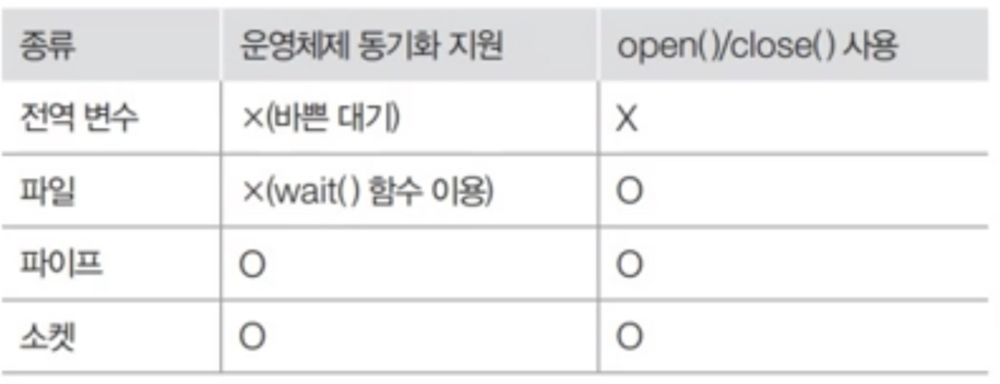

# CH5 프로세스 동기화

## 프로세스 간 통신의 개념

프로세스 간 통신(IPC)은 서로 다른 프로세스들이 데이터를 주고받는 메커니즘입니다. 운영체제는 프로세스 간의 독립성과 보안을 위해 각 프로세스에게 독립된 메모리 공간을 할당합니다. 그러나 여러 프로세스가 협력하여 작업을 수행해야 하는 경우가 많으므로, 이때 IPC 메커니즘이 필요

## 프로세스 간 통신의 종류

- **공유 메모리나 공유 파일을 위한 통신:**  가장 원시적이며 일전한 메모리 영역이나 파일을 공유하고 이를 통해 데이터를 주고 받는다. (원시적인 방식)
- **파이프를 이용한 통신:** 하나의 컴퓨터 내에서 프로세스 간 통신에 많이 사용되는 수단, 보통의 경우 **`fork()`** 로 만들어진 부모-자식 간 통신에 사용
- **소켓을 이용한 통신:** 컴퓨터와 컴퓨터간 네트워크로 연결된 경우 통신의 주로 사용, 하나의 컴퓨터에서도 사용이 가능하지만 파이프 보단 소켓 방식은 초기화할 내용도 많고 시스템 자원 많이 사용되어 소켓 통신은 비효율적

## 프로세스 간 통신의 목적

- **정보 공유**: 여러 프로세스가 동일한 데이터에 접근해야 할 때
- **계산 속도 향상**: 작업을 여러 프로세스로 나누어 병렬 처리할 때
- **모듈성**: 시스템 기능을 별도의 프로세스로 분리할 때
- **편의성**: 여러 사용자가 동시에 같은 데이터에 접근할 때

## 프로세스 간 통신의 분류

### 통신 방향에 따른 분류

**프로세스 간 통신**은 동시에 실행되는 프로세스끼리 데이터를 주고받는 작업입니다. **함수 호출**은 하나의 프로세스 내에서 순차적으로 실행되므로 통신이라고 부르지 않습니다.

- **양방향 통신**: 데이터를 동시에 양쪽으로 전송 가능. 일반적인 통신은 대부분 양방향 통신입니다. (예: 소켓 통신)
- **반양방향 통신**: 데이터를 양쪽으로 전송 가능하나 동시에는 불가능. 한쪽이 말하면 다른쪽은 들어야 합니다. (예: 무전기)
- **단방향 통신**: 한쪽으로만 데이터 전송 가능. 양방향으로 통신하려면 단방향 통신 두 개가 필요합니다. (예: 모스 신호, 전역 변수, 파이프)

### 통신 구현 방식에 따른 분류

**바쁜 대기**: 전역 변수를 사용하는 통신에서는 데이터가 언제 도착할지 알 수 없습니다. 수신 프로세스는 데이터 도착을 확인하기 위해 반복문을 무한 실행하며 기다려야 합니다(busy waiting).

**동기화**: 데이터가 도착했음을 알려주는 메커니즘입니다.

- **대기가 있는 통신(동기화 통신)**: 동기화를 지원합니다. 데이터를 받는 프로세스는 데이터가 도착할 때까지 자동으로 대기 상태에 머물러 있으며, CPU를 사용하지 않습니다. (예: 파이프, 소켓)
- **대기가 없는 통신(비동기화 통신)**: 동기화를 지원하지 않습니다. 데이터를 받는 프로세스는 바쁜 대기를 사용하여 데이터가 도착했는지 여부를 직접 반복적으로 확인해야 합니다. (예: 전역 변수)

## 프로세스 간 통신의 종류

### 전역 변수를 이용한 통신

- 공동 메모리를 사용하여 데이터 교ㅎㅘㄴ
- 데이터 수신 측은 전역 변수 값 변화를 바쁜 대기로 확인해야 함
- 주로 부모-자식 프로세스 같이 직접 관련된 프로세스 간 사용
- 동기화 지원 없음

### 파일을 이용한 통신

- 파일 열기(open), 쓰기/읽기(write/read), 닫기(close) 과정으로 구성
- 프로세스 간 통신 방식으로 파일 사용
- 부모-자식 관계 프로세스 간 통신에 많이 사용
- 동기화 지원 없음 (부모가 wait() 함수로 자식 프로세스 종료 대기)

### 파이프를 이용한 통신

- 운영체제가 제공하는 동기화 통신 방식
- 단방향 통신 (양방향은 파이프 2개 필요)
- 대기 상태 지원: 읽기 시도 시 데이터가 없으면 자동으로 대기 상태로 전환
- 종류:
    - **이름 없는 파이프:** 관련 있는 프로세스 간 통신(부모-자식)
    - **이름 있는 파이프(FIFO):** 관련 없는 프로세스 간 통신

### 소켓을 이용한 통신

- 다른 컴퓨터에 있는 프로세스 간 네트워크 통신에 사용
- 동기화 지원 (바쁜 대기 불필요)
- 양방향 통신 가능 (하나의 소켓으로)
- 원격지 프로세스를 식별하고 데이터 전송

### 🧹 정리

- 프로세스 간 데이터 교환: 읽기와 쓰기 연산으로 이루어짐
- 부모-자식 관계: 전역변수/파일/이름 없는 파이프
- 독립적 프로세스: 이름 있는 파이프
- 다른 시스템 프로세스: 소켓
- 동기화 지원: 파이프, 소켓 (바쁜 대기 불필요)
- open-read/write-close 구조: 파일, 파이프, 소켓에 적용

## 공유 자원과 임계구역

### 1. 공유 자원의 접근

**공유 자원(shared resource)**

- 여러 프로세스가 공동으로 이용하는 변수, 메모리, 파일 등
- 접근 순서에 따라 결과가 달라질 수 있어 주의 필요

**경쟁 조건(race condition)**

- 2개 이상의 프로세스가 공유 자원을 병행적으로 접근하는 상황
- 접근 순서에 따라 실행 결과가 달라질 수 있음

### 2. 임계구역(critical section)

- 공유 자원 접근 순서에 따라 결과가 달라지는 프로그램 영역
- 각 프로세스가 전역 변수를 사용하는 부분
- '중요한'이란 의미로, 공유할 수 없는 자원이 중요 자원
- 예: 주방에서 가스레인지는 공유 가능, 믹서기는 공유 불가능(임계구역)
- 한 프로세스가 임계구역에 들어가면 다른 프로세스는 대기해야 함

### 3. 생산자-소비자 문제

- 생산자는 물건을 생산해 버퍼에 넣고 **`[input(buf)]`** , 소비자는 버퍼에서 물건 가져옴**`[output(buf)]`**
- 원형 버퍼(circular buffer) 사용
- 버퍼 상태 확인을 위해 sum이라는 전역 변수 사용
- 문제 발생: 생산자와 소비자가 동시에 sum에 접근하면 결과 예측 불가
    - 예: sum=3일 때 생산자의 sum=sum+1과 소비자의 sum=sum-1이 거의 동시 실행
    - 최종 sum 값은 2나 4가 될 수 있음
- 임계구역은 전역변수뿐 아니라 하드웨어 자원(프린터 등)에도 적용됨

### 4. 임계구역 해결 조건

**조건 1. 상호 배제**

- 한 프로세스가 임계구역에 있으면 다른 프로세스는 진입 불가
- 임계구역에는 항상 하나의 프로세스만 존재해야 함

**조건 2. 한정 대기**

- 어떤 프로세스도 무한정 대기하지 않아야 함
- 모든 프로세스는 결국 임계구역에 진입 가능해야 함

**조건 3. 진행의 융통성**

- 한 프로세스가 다른 프로세스의 진행을 방해해서는 안 됨
- 임계구역이 비어있다면 진입 희망 프로세스는 즉시 진입 가능해야 함
- 예: 두 요리사가 믹서기 사용 시, 한 요리사가 사용 순서를 양보했다고 무조건 기다릴 필요 없음

## 임계 구역 문제 해결 방법

> **잠금(lock)**: 임계구역 진입 전 잠금, 퇴장 시 해제하는 기본 방식
>
>
> 임계구역 해결 조건: 상호 배제, 한정 대기, 진행의 융통성
>

### 소프트웨어적 해결 방법과 한계

**상호 배제 문제 해결 시도**

- 단일 잠금 변수 사용
- 문제점: 잠금 확인과 설정 사이에 타임아웃 발생 시 두 프로세스가 동시 진입 가능

**한정 대기 문제 해결 시도**

- 프로세스별 잠금 변수 사용(lock1, lock2)
- 문제점: 교착 상태(deadlock) 발생 가능, 확장성 문제

**진행의 융통성 문제 해결 시도**

- 교대로 실행되는 방식(turn 변수 사용)
- 문제점: 경직된 동기화(lockstep synchronization), 한 프로세스가 연속 실행 불가

### 하드웨어적 해결 방법

- **검사와 지정(test-and-set)**: 하나의 명령으로 실행하여 타임아웃 문제 해결
- 장점: 간단한 구현
- 단점: 바쁜 대기로 자원 낭비

### 고급 알고리즘

**피터슨 알고리즘**

- 임계구역 세 조건 모두 만족
- 한계: 2개 프로세스에만 적용 가능

**데커 알고리즘**

- 하드웨어 도움 없이 임계구역 문제 해결
- 단점: 복잡한 구현, 확장성 문제

### 세마포어(Semaphore)

- 기본 작동: 진입 시 P() 호출(잠금), 퇴장 시 V() 호출(해제)
- 특징: 바쁜 대기 없음, 다중 자원 관리 가능
- 구성: Semaphore(n) - 초기화, P() - 잠금, V() - 해제
- 문제점: 사용자 실수로 인한 오류 가능성(P/V 누락 또는 순서 오류)

### 모니터(Monitor)

- 공유 자원을 내부적으로 숨기고 인터페이스만 제공
- 사용자는 직접 잠금 처리 없이 함수만 호출
- 내부적으로 동기화 자동 처리(wait(), signal() 사용)
- 장점: 사용자 실수 방지, 객체지향 개념과 유사

# 참고 : [https://github.com/shinhyunji36/easy-to-learn-os-study/tree/main](https://github.com/shinhyunji36/easy-to-learn-os-study/tree/main)