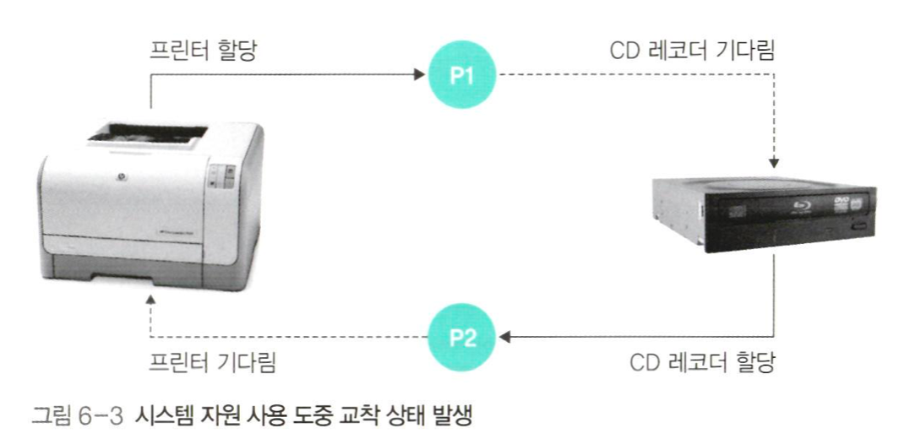

# CH6 교착상태

## 교착상태의 정의

2개 이상의 작업이 동시에 이루어지는 경우 다른 작업이 끝나기만 기다리며 작업을 더 이상 진행하지 못하는 상태

e.g) 교통 체증

교통 상태는 아사 현상과 비슷해 보이지만 차이 존재

- **아사현상:** 운영체제가 잘못된 정책으로 특정 프로세스의 작업이 지연되는 문제
- **교착상태:** 여러 프로세스가 작업하기에 자연스럽게 발생하는 문제
    - 운영 체제는 감시를 하다가 교착 상태가 발생하면 강압적 해결

  


**시스템 자원 :** 다른프로세스와 공유할 자원이 없을 사용시 발생, 동시에 같이 사용될 수 없는 시스템 자원을 할당 받은후 양보하지 않은 경우


**잠금:** 공유 변수를 사용할 때도 교착 상태가 발생할 수 있습니다. 그림 [6-4]의 코드에서 프로세스 p1이 lock1을 true로 설정하고, 동시에 프로세스 p2가 lock2를 true로 설정하면, p1은 lock2가 true인 상태에서 무한 대기하고, p2는 lock1이 true인 상태에서 무한 대기하게 됩니다. 결과적으로 두 프로세스 모두 임계구역에 진입하지 못하고 교착 상태에 빠집니다.

e.g) java

```java
class SharedResource {
    // 이것이 공유 변수
    public static boolean lock1 = false;
	  // 이것이 공유 변수
    public static boolean lock2 = false;
}

// 임계 구역
synchronized(object) { 
    // 임계 구역 코드
}
```

- **응용 프로그램:** 데이터베이스 같은 응용프로그램에서도 교착 상태가 발생한다. 여러 프로세스가 데이터베이스에 저장된 데이터를 사용할 때 데이터의 **일관성**을 유지해야 한다.

  S데이터베이스는 데이터의 일관성을 유지하기 위해 잠금을 사용하는데 이 때 교착 상태가 발생할 수 있다.


### 자원 할당 그래프

프로세스가 어떤 자원을 사용하는 간의 자원 관계를 그래프 표현 (사용,기다림)


목적

- 프로세스가 현재 어떤 자원을 사용 중인지 확인
- 프로세스가 어떤 자원을 기다리고 있는지 파악
- 교착 상태(deadlock) 발생 가능성 분석

**그래프 구성 요소**

- **프로세스**: P1, P2, ... (원으로 표시)
- **자원**: R1, R2, ... (사각형으로 표시)

**화살표 의미**

- **프로세스 → 자원**: 프로세스가 자원을 요청/대기 중 (점선 화살표)
- **자원 → 프로세스**: 자원이 프로세스에 할당됨 (실선 화살표)

**예시 해석**

- 왼쪽: 프로세스 P1이 자원 R1을 할당받음 (R1 → P1)
- 오른쪽: 프로세스 P1이 자원 R1을 기다림 (P1 → R1)

**다중자원: 자원이 2개 이상의 프로세스를 동시에 허용하는 경우**

- 다중 자원은 수용할 수 있는 프로세스 수를 사각형 안에 작은 동그라미로 표현한다.
- 왼쪽 그림처럼 작은 동그라미가 2개 있으면 그 자원을 2개의 프로세스가 동시에 사용할 수 있다는 의미이다.
- 오른쪽 그림은 앞에서 말한 교착상태를 표현한다.

### 다중자원 (자원이 2개 이상의 프로세스를 동시에 허용하는 경우)


- 다중 자원은 수용할 수 있는 프로세스 수를 사각형 안에 작은 동그라미로 표현
- 일측 그림처럼 작은 동그라미가 2개 있으면 그 자원을 2개의 프로세스가 동시에 사용 가능
- 오른쪽 그림은 앞에서 말한 교착상태를 표현한 예시

**그림 6-6: 2개의 프로세스를 수용할 수 있는 자원**

- R2 자원이 P2와 P3 프로세스에 모두 할당된 상태

**그림 6-7: 요리사 문제의 자원 할당 그래프**

- 요리사 A는 젓가락을 기다리고 있고, 믹서를 사용 중
- 요리사 B는 믹서를 기다리고 있고, 젓가락을 사용 중

**교착 상태가 발생하는 조건**

1. **상호 배제**: 철학자들은 서로 포크를 공유할 수 없다 → 자원을 공유하지 못하면 교착 상태 발생
2. **점유 대기**: 각 철학자는 다른 철학자의 포크를 빼앗을 수 없다 → 자원을 빼앗을 수 없으며 자원을 놓을 때까지 기다려야 하므로 교착상태 발생
3. **비선점**: 각 철학자는 일측 포크를 잡은 채 오른쪽 포크를 기다린다 → 자원 하나를 잡은 상태에서 다른 자원을 기다리면 교착 상태 발생
4. **순환 대기**: 자원 할당 그래프가 원형이다 → 자원을 요구하는 방향이 원을 이루면 양보를 하지 않기 때문에 교착 상태 발생

### 교착 상태 해결 방법

**1. 교착 상태 예방**

교착 상태를 유발하는 네 가지 조건(상호 배제, 비선점, 점유와 대기, 원형 대기)을 무력화하는 방식입니다.

상호 배제 예방

- 독점적으로 사용할 수 있는 자원을 없애는 방법
- 모든 자원을 공유하기는 현실적으로 불가능함

**비선점 예방**

- 모든 자원을 빼앗을 수 있도록 만드는 방법
- 아사 현상이 발생할 수 있으며, 에이징으로 해결해도 다시 교착 상태에 빠질 수 있음

**점유와 대기 예방**

- 프로세스가 필요한 모든 자원을 한번에 할당받거나 아예 할당받지 않도록 함
- **단점**:
    1. 프로세스가 사용할 모든 자원을 미리 예측하기 어려움
    2. 자원 활용성이 떨어짐
    3. 많은 자원을 사용하는 프로세스가 불리함
    4. 일괄 작업 방식으로 동작하게 됨

**원형 대기 예방**

- 자원을 한 방향으로만 사용하도록 설정
- **단점**:
    1. 프로세스 작업 진행의 유연성이 떨어짐
    2. 자원의 번호 부여 방식이 문제가 될 수 있음

**2. 교착 상태 회피**

프로세스에 자원을 할당할 때 안전 상태를 유지할 수 있는 범위 내에서만 자원을 **할당하는 방법**입니다.

**은행원 알고리즘**

- 각 프로세스가 사용할 최대 자원 수를 미리 선언
- 주요 변수:
    - 전체 자원: 시스템 내 전체 자원의 수
    - 가용 자원: 현재 사용 가능한 자원의 수
    - 최대 자원: 각 프로세스가 선언한 최대 자원 수
    - 할당 자원: 현재 각 프로세스에 할당된 자원 수
    - 기대 자원: 앞으로 필요한 자원 수 (최대 자원 - 할당 자원)

**문제점**

1. 프로세스가 사용할 모든 자원을 미리 선언해야 함
2. 시스템의 전체 자원 수가 고정적이어야 함
3. 자원이 낭비됨

3. **교착 상태 검출과 회복**

가장 현실적인 교착 상태 해결 방법으로, 교착 상태 발생을 감시하고 발생 시 회복하는 방식입니다.

타임아웃을 이용한 교착 상태 검출

- 일정 시간 동안 작업이 진행되지 않는 프로세스를 교착 상태로 간주
- **단점**:
    - 엉뚱한 프로세스가 강제 종료될 수 있음
    - 모든 시스템에 적용할 수 없음
- 데이터베이스에서는 체크포인트와 롤백을 사용하여 데이터 일관성 유지
    - 체크포인트: 작업 중 현재 상태를 저장하는 표시
    - 스냅숏: 체크포인트에 저장된 시스템 상태
    - 롤백: 문제 발생 시 체크포인트로 되돌아가는 것

**자원 할당 그래프를 이용한 교착 상태 검출**

- 시스템 내 프로세스의 자원 사용 및 대기 상태를 그래프로 모니터링

**교착 상태 회복**

- 프로세스 강제 종료 방법:
    1. 교착 상태를 일으킨 모든 프로세스를 동시에 종료
    2. 교착 상태를 일으킨 프로세스를 순서대로 종료
        - 우선순위가 낮은 프로세스부터 종료
        - 작업 시간이 짧은 프로세스부터 종료
        - 자원을 많이 사용하는 프로세스부터 종료
- 시스템 복구: 체크포인트를 사용하여 최근 검사 시점으로 복귀 (시스템 부하가 크므로 선택적 사용 필요)