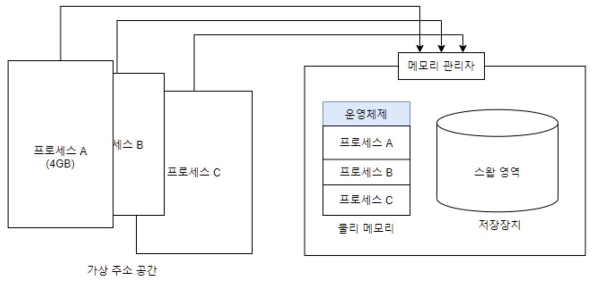

# 가상 메모리의 기초

### 가상 메모리 Virtual Memory 는 크기가 다른 물리메모리에서 일관되게 프로세스를 실행 할 수 있는 기술

## 가상 메모리 시스템

- 가상 메모리는 물리 메모리의 크기와 상관없이 프로세스에 커다란 메모리 공간을 제공 하는 기술
    - 덕분에 물리메모리의 크기가 어느정도인지 신경 쓰지 않고 마음대로 메모리를 사용 가능

## 가상 메모리 크기와 주소

모든 프로세스는 어느 위치에 있는지 상관없이 0번부터 시작하는 연속된 메모리 공간을 가짐

이미지 출처:[https://prao.tistory.com/entry/쉽게-배우는-운영체제-8-가상-메모리의-기초](https://prao.tistory.com/entry/%EC%89%BD%EA%B2%8C-%EB%B0%B0%EC%9A%B0%EB%8A%94-%EC%9A%B4%EC%98%81%EC%B2%B4%EC%A0%9C-8-%EA%B0%80%EC%83%81-%EB%A9%94%EB%AA%A8%EB%A6%AC%EC%9D%98-%EA%B8%B0%EC%B4%88)

e.g) 만약 10개의 프로세스를 동시 실행하면 40GB 메모리가 필요한데

이럴땐 가상 메모리 시스템에서 물리 메모리의 내용 중 일부를 하드디스크의 일부 공간, 즉 스왑 영역으로 보냄

가상 메모리 시스템에서 메모리 관리자는 물리 메모리와 스왑 영역을 합쳐서 프로세스가 사용하는 가상 주소를 실제 메모리의 물리 주소로 변환하는데 이걸 동적 주소 변환 **(DAT : Dynamic Address Translation)**

> 📌 가상 메모리에서 메모리 관리자가 사용할 수 있는 메모리의 전체 크기는 물리메모리(실제 메모리)와 스왑 영역을 합한 크기
>

## 매핑 테이블의 필요성과 역할

메모리는 매핑 테이블을 작성하여 관리, 가상 메모리 시스템에서 가상 주소는 실제로 물리주소나 스왑 영역 한 곳에 위치

**페이징과 세그먼테이션** : 메모리 관리 방식은 고정 분할 방식인 페이징과 가변 분할 방식인 세그먼테이션으로 나뉜다. 페이징은 페이징 테이블을 사용하여 주소를 변환하고, 세그먼테이션은 세그먼테이션 테이블을 사용하여 주소를 변환한다.

### 지역성

지역성은 기억장치에 접근하는 패턴이 메모리 전에체 고루 분포되는 것이 아니라 특정 영역에 집중되는 성질

- **공간의 지역성:** 현재 위치에서 가까운 데이터의 접근할 확률이 먼 거리에 있는 데이터에 접근할 확률 보다 높음을 의미
- **시간의 지역성:** 현재 기준으로 가장 가까운 시간에 접근한 데이터가 먼 시간에 접근한 데이터 보다 사용될 확률이 높음을 의미
- **순차적 지역성:** 작업이 순서대로 진행되는 것을 의미 (일반적인 프로그래밍)

### 페이징 기법

고정 분할 방식으로 메모리 관리 기법

- 물리 주소공간을 같은 크기로 나누어 사용
- 가상 주소 공간에서 분할된 각 영역을 페이지, 물리 주소 공간의 영역을 각각 프레임

> 페이징 기법에서 주소 변환 과정에선
>

PA는 물리 메모리의 주소, 물리 주소 또는 실제 주소

F는 프레임, D는 프레임의 처음 위치에서 해당 주소까지 거리

### 정형화 된 주소 변환

- 가상 주소를 VA = <P,D>로 표현
- VA는 가상주소 P는 페이지 D는 페이지의 처음위치에서 해당 주소 까지 거리
    - 비유: D는 게시판 페이지네이션으로 비유하면 한 페이지의 보여질 수 page size라 생각하자

**페이징 기법의 주소 변환 과정**

VA = <P,D> → PA = <F,D>

### 페이지 테이블 엔트리(PTE: Page Talbe Entry)

- 페이지 테이블은 페이지 번호와 프레임 번호로 구성 → 각각의 한 줄을 페이지 테이블 엔트리라고 부른다
- 페이지 테이블은 페이지 번호와 프레임 번호로 구성된 페이지 테이블 엔트리의 집합

**페이지 테이블 관리**

- 시스템 내에는 여러개의 프로세스가 존재하고 각 프로세스는 하나의 페이지 테이블을 가지며, 페이지 테이블은 운영체제 영역에 존재
- 페이지 테이블의 크기가 너무 커지면 프로세스가 실제로 사용할 수 있는 메모리가 줄어듬
- 페이지 테이블 전체를 메모리에서 관리하느냐, 일부를 스왑 영역에서 관리하느냐에 따라 가상 주소를 물리 주소로 변환하는 방법이 달라짐

### 세그먼테이션 기법

세그먼테이션에서는 하나의 연속된 공간을 세그먼트라고 한다. 세그먼테이션 테이블에는 물리 메모리의 시작 주소를 나타내는 address와 세그먼트의 크기를 나타내는 limit가 있다. 물리 메모리에 접근할 때마다 거리 D의 크기가 limit보다 작은지 매번 확인

- 가변 분할 방식을 이용한 가상 메모리 관리 기법, 물리 메모리를 프로세스의 크기에 따라 가변적으로 나누어 사용
- 세그먼테이션 기법에서도 물리 메모리가 부족할 때 스왑 영역 사용

> 가상 주소 VA = <S,D>
S 는 세그먼트 번호, D는 세그먼트 시작 지점에서 해당 주소 까지의 거리
>