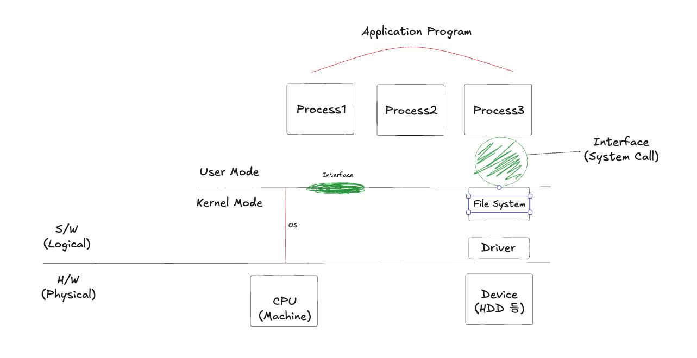

# 1주차 발표자료

> 주제: **운영체제의 정의와 구성**

## 컴퓨터 = 하드웨어 + 소프트웨어

- 컴퓨터는 크게 `하드웨어`와 `소프트웨어`로 구성됩니다.
- `소프트웨어`는 **하드웨어를 제어해서 작업을 수행시키는 명령의 모음**입니다. `프로그램`이라고 할 수 있습니다.
- 소프트웨어는 하드웨어에 명령을 내려서 필요한 작업을 수행해서 데이터를 정보로 바꿉니다.

### 소프트웨어 = 응용 프로그램 + 시스템 소프트웨어

- `응용 프로그램(Application Program)`: **문서 작성을 위한 한글, 워드 등과 같이 특정 작업을 위해 사용하는 프로그램**
- `시스템 소프트웨어(System Software)`: **컴퓨터 하드웨어와 응용 프로그램을 관리하기 위한 소프트웨어**입니다. 크게 운영체제와 유틸리티가 있습니다.

#### 유틸리티(Utility)

> **운영체제의 기능이 많아지고 구조가 복잡해짐에 따라 바이러스 검사, 디스크 조각 모음과 같이 운영체제의 작업을 보조하는 소프트웨어를 의미합니다.**

### 인터페이스

- 사용자가 컴퓨터를 사용할 수 있도록 해주고 그 결과를 사용자에게 알려주는 장치를 `인터페이스` 라고 합니다.
- **운영체제는 사용자가 컴퓨터를 보다 쉽게 사용할 수 있도록 다양한 인터페이스를 제공함으로써 컴퓨터 자원을 보호함과 동시에 사용자 편의를 도모합니다.**
- 사용자와 응용 프로그램에 인접해서 커널에 명령을 전달하고 실행 결과를 사용자와 응용프로그램에 반환합니다.

 

## 컴퓨터 구조와 운영체제

> - `운영체제(OS)`: **컴퓨터 자원을 효율적으로 관리하는 소프트웨어**
> - 사용자에게 인터페이스를 제공하고 응용 프로그램에 컴퓨터 자원을 골고루 배분해서 작업할 수 있는 환경을 만들어줍니다. 이 외에도 다양한 작업을 담당합니다.

- `운영체제`는 `커널`과 `인터페이스`로 나뉩니다.
- `커널`은 **프로세스 관리, 메모리 관리, 저장장치 관리**와 같은 `운영체제의 핵심 기능`을 모아놓은 것입니다. 그리고 어떤 사용자나 응용 프로그램도 컴퓨터 자원에 직접 접근할 수 없습니다.

 

## 운영체제의 역할과 목표

- `자원 관리(효율성)`: 컴퓨터 자원을 응용 프로그램에 나누어줘서 사용자가 원활하게 작업할 수 있도록 합니다.
- `자원 보호(안정성)`: 비정상적인 작업으로부터 컴퓨터 자원을 보호합니다.
- `하드웨어 인터페이스 제공(확장성)`: 복잡한 과정 없이 다양한 장치를 사용할 수 있도록 해주는 하드웨어 인터페이스 제공(드라이버)
- `사용자 인터페이스 제공(편리성)`: 사용자가 운영체제를 편리하게 사용하도록 지원하기 위한 것 (CLI와 GUI)

 

## 시스템 호출

> - **커널이 자신을 보호하기 위해 만든 인터페이스입니다.**
> - 컴퓨터 자원을 보호하기 위해서 사용자나 응용 프로그램이 자원에 직접 접근하는 것을 차단합니다.

- 시스템 호출은 커널이 제공하는 시스템 자원을 사용하기 위한 함수입니다.
- 응용 프로그램이 하드웨어 자원에 접근하거나 운영체제가 제공하는 서비스를 이용하려면 시스템 호출을 사용해야 합니다.
- 운영체제는 커널이 제공하는 서비스를 시스템 호출로 제한하고 다른 방법으로는 커널에 들어오지 못하게 막아 컴퓨터 자원을 보호합니다.
- 시스템 호출은 커널이 제공하는 서비스를 이용하기 위한 인터페이스이고, 사용자가 자발적으로 커널 영역에 진입할 수 있는 유일한 수단입니다.

유사한 용어로는 `응용 프로그램 인터페이스(API)`와 `시스템 개발자용 키트(SDK)`가 있습니다.

 

## 전체 구조도

