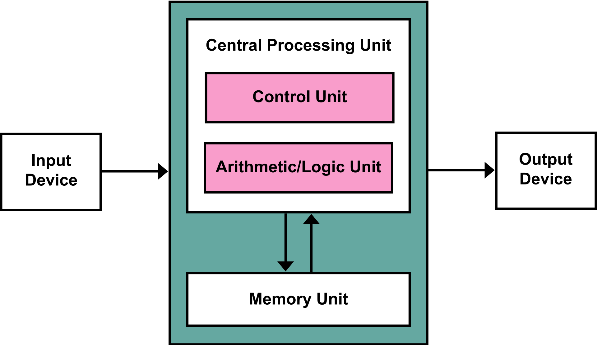
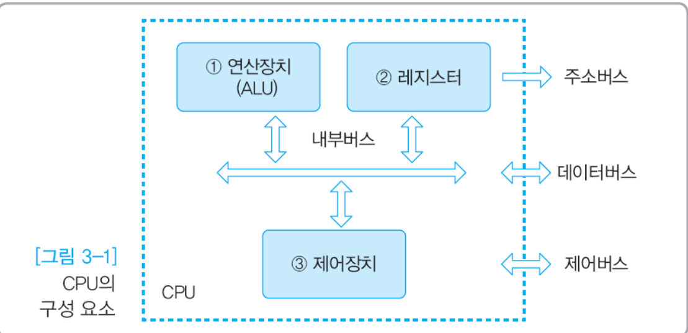

# 챕터2) 컴퓨터의 구조와 성능 향상

## 하드웨어의 구성

> - **컴퓨터 = 중앙처리장치(CPU) + 메인메모리 + 입출력장치 + 저장장치**
> - 핵심 장치는 **CPU와 메인메모리**입니다.

- `CPU(중앙처리장치)`: 명령어를 해석해서 실행하는 장치
- `메모리`: 작업에 필요한 프로그램과 데이터를 저장하는 장소, 바이트 단위로 분할되어 있고, 분할 공간마다 주소로 구분합니다.
- `입출력장치`
- `저장장치`
  - 메모리에 비해 속도가 느리지만 저장 용량에 비해 가격이 저렴하고 반영구적으로 데이터를 저장합니다.
  - 플로피디스크, 하드디스크 등의 **자성을 이용하는 장치**, CD와 같은 **레이저를 이용하는 장치** 그리고 SD카드, USB 등의 **메모리를 사용하는 장치**가 있다.
- `메인보드`
  - CPU와 메모리 등 다양한 부품을 연결하고 전원을 공급해주는 커다란 판
  - 각 장치를 연결하며 데이터가 지나다니는 통로를 `버스(bus)`라고 합니다.

## 폰노이만 구조

> - **CPU, 메모리, 입출력장치, 저장장치가 버스로 연결된 구조**
> - 가장 중요한 특징은 **"모든 프로그램은 메모리에 올라와야 실행할 수 있다"** 는 것입니다.

이전의 컴퓨터들은 스위치를 설치하고, 전선을 연결해서 데이터를 전송하고 신호를 처리하는 식으로 프로그래밍을 했습니다. 
**현재와 같은 CPU, 메모리, 프로그램 구조를 갖는 범용 컴퓨터 구조가 확립되면서 하드웨어적으로 전선을 재배치할 필요 없이 소프트웨어만 교체해서 다른 작업을 수행할 수 있도록 합니다.**

## 운영체제의 작업

> `프로세스 관리`, `메모리 관리`, `저장장치 관리`

## 시스템 버스와 CPU 버스

- `시스템 버스`: 메모리와 주변장치를 연결하는 버스이고, 메인보드의 동작 속도를 의미합니다.
- `CPU 버스`: CPU 내부의 다양한 장치를 연결하는 버스입니다. 시스템 버스보다 속도가 훨씬 빠릅니다.

## 컴파일과 인터프리터

> [컴파일과 인터프리터의 차이](https://velog.io/@jhur98/%EC%BB%B4%ED%8C%8C%EC%9D%BC%EB%9F%ACcompiler%EC%99%80-%EC%9D%B8%ED%84%B0%ED%94%84%EB%A6%AC%ED%84%B0interpreter%EC%9D%98-%EC%B0%A8%EC%9D%B4)

Java와 같은 고급 프로그래밍 언어를 사용하면서 이를 기계어/어셈블리어로 번역해주는 작업이 필요합니다. 
번역하는 방식은 크게 컴파일러 방식과 인터프리터 방식이 있습니다.

| 항목           | 컴파일러(Compiler)                  | 인터프리터(Interpreter)                 |
| -------------- | ----------------------------------- | --------------------------------------- |
| 번역 방식      | 전체 파일을 스캔하여 한꺼번에 번역  | 프로그램 실행 시 한 번에 한 문장씩 번역 |
| 초기 스캔 시간 | 오래 걸림                           | 빠름                                    |
| 실행 속도      | 빠름 (한번 실행 파일이 만들어진 후) | 느림 (한 문장씩 번역 후 실행)           |
| 메모리 사용    | 더 많은 메모리 사용                 | 메모리 효율이 좋음                      |
| 오류 발견 시점 | 실행 전에 모든 오류 출력            | 실행 후 오류 발견 시 즉시 중지          |
| 대표 언어      | C, C++, JAVA                        | Python, Ruby, Javascript                |

---

## CPU의 기본 구성

