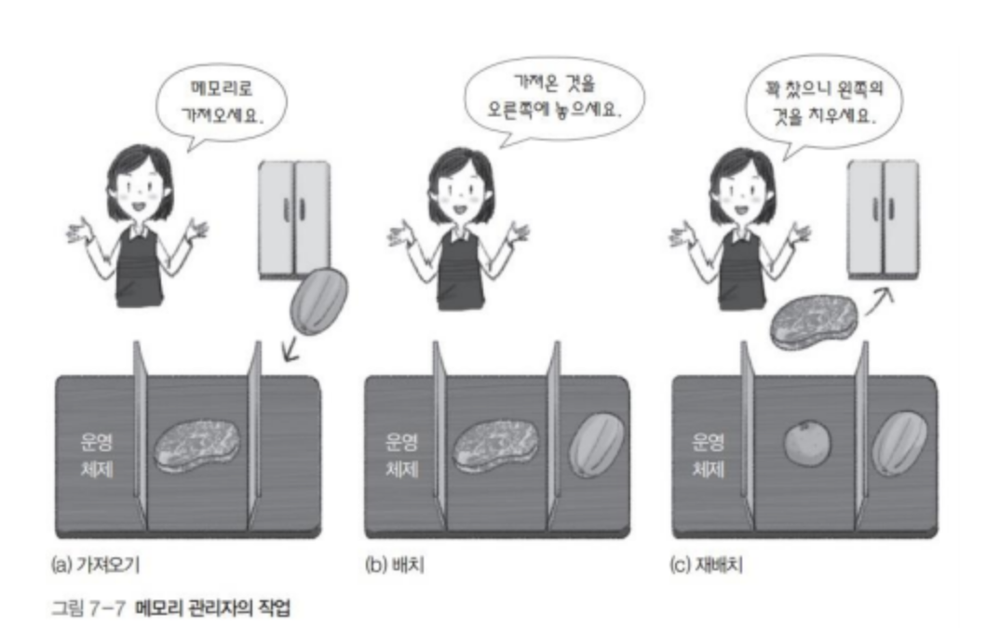
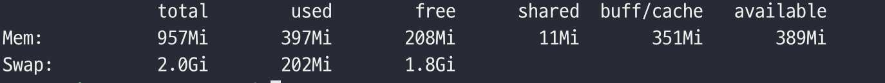

# 챕터07) 메모리 관리의 개요

## 메모리와 부팅

- 메모리 하나의 셀은 1바이트
- 주소(Address)
- **운영체제도 프로그램이기 때문에 메모리에 올라와야 실행할 수 있음.**
- `부팅`: 컴퓨터의 전원 버튼을 누르면 사용자가 컴퓨터를 사용할 수 있는 환경을 마련하는 과정
- 하드디스크에 저장된 운영체제가 메모리에 올라가게 된다.

### 메모리에 있는 데이터를 CPU로 가져오는 과정

> - **접근하려는 메모리 주소를 `메모리 주소 레지스터(MAR)`에 넣음 -> `주소 버스`를 통해 메모리에 전달**
> - **메모리에서 전달받은 주소에 해당하는 값을 `데이터 버스`를 통해 `메모리 버퍼 레지스터(MBR)`에 넣어서 보냄**
> - **MBR에 있는 데이터가 레지스터로 옮겨지면 끝난다.**

## 메모리 관리자

> **`메모리 관리자(Memory Manage Unit, MMU)`: 메모리 관리를 담당하는 하드웨어**

- `가져오기(Prefetch)`: 프로세스와 데이터를 메모리로 가져옴
- `배치(Placement)`: 가져온 프로세스와 데이터를 메모리의 어떤 부분에 올려놓을지 결정 (페이징과 세그멘테이션)
- `재배치(Replacement)`: 꽉 차있는 메모리에 새로운 프로세스를 가져오기 위해 오래된 프로세스를 내보내는 과정

## 32Bit CPU vs 64Bit CPU

- **한번에 다룰 수 있는 데이터의 최대 크기 (ex. 32bit -> 2^32 = 약 4GB)**
- CPU 내부 부품은 모두 해당 비트를 기준으로 제작됨 (ALU, 레지스터 등)
- `물리주소공간`: 하드웨어 입장에서 바라본 주소 공간
- `논리주소공간`: 사용자 입장에서 바라본 주소 공간

## 경계 레지스터

> - **운영체제 영역과 사용자 영역 경계 지점의 주소를 가진 레지스터**
> - **사용자 영역과 운영체제 영역의 침범을 막음**
> - **메모리 관리자가 사용자의 작업을 요청할 때마다 경계 레지스터의 값을 벗어나는지를 검사하고 벗어나면 프로세스를 종료시킨다.**

## 메모리 오버레이 (Memory OverLay)

> - **프로그램의 크기가 물리 메모리보다 크면 프로그램을 잘라서 가져오는 기법**
> - **물리 메모리보다 더 큰 프로그램을 실행할 수 있음**
> - 워드 프로그램에서 맞춤법 감사 프로세스와 인쇄 동시에?
> - 프로그램 카운터(PC)의 역할은 어떤 모듈을 가져오거나 내보낼지 정해주는 역할

## 스왑 (Swap)

## 다중 프로그래밍 환경에서의 메모리 할당

### 메모리 분할 방식

- `가변 분할 방식`: 프로세스의 크기에 따라 메모리를 나누는 것
- `고정 분할 방식`: 프로세스의 크기와 상관없이 메모리를 같은 크기로 나누는 것

#### <가변 분할 방식>

- 프로세스의 크기에 맞게 메모리가 분할됨
- 메모리의 영역이 각각 다름
- 연속 메모리 할당
- **프로세스를 한덩어리로 처리해서 하나의 프로세스를 연속된 공간에 배치할 수 있다는 장점이 있지만 비어 있는 공간을 하나로 합쳐야 하는 외부 단편화 문제가 있다.**
  - 외부 단편화 해결 방법으로는 메모리 배치 방식 조절과 조각모음이 있다.

#### <고정 분할 방식>

- 프로세스의 크기에 상관없이 메모리가 같은 크기로 나뉨
- 큰 프로세스가 메모리에 올라오면 여러 조각으로 나누어 배치
- 비연속 메모리 할당
- **메모리 관리가 수월하지만 쓸모없는 공간으로 인해 메모리 낭비가 발생하는 내부 단편화 문제가 있다.**
