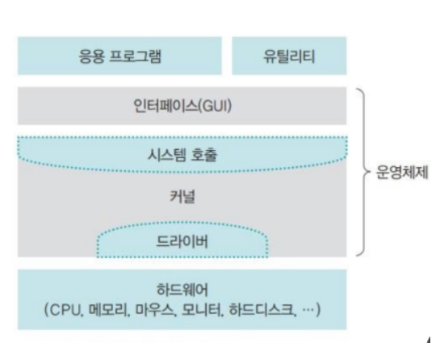

# 1장 발표

# 운영 체제 소개

대표적인 운영체제

- 윈도우
- Mac OS
- 리눅스
- iOS
- 안드로이드

컴퓨터란? **프로그래밍이 가능한 기계**

→ 기계는 성능을 높이거나 기능을 추가하려면 기계 자체를 새로 제작. 하지만 컴퓨터의 경우 프로그래밍이 가능하기 떄문에 프로그램을 변경하면 됨.

→ 프로그램이란? 컴퓨터는 하드웨어와 소프트웨어로 구성되어 있는데 하드웨어를 제어하여 작업을 수행시키는 명령의 모음.

→ 이러한 응용 프로그램의 잘못된 동작으로 컴퓨터가 망가지는 것을 막기 위해 컴퓨터 전체를 관리하고 운영하는 소프트웨어? **운영체제**

**운영체제 = 커널 + 인터페이스**

- 커널: 운영체제의 핵심 기능을 모아놓은 것
- 인터페이스: 사용자와 응용 프로그램에 인접하여 커널에 명열을 내리고 실행 결과를 사용자와 응용프로그램에 알려줌

### 운영 체제의 역할

1. 자원 관리
2. 자원 보호
3. 하드웨어 인터페이스 제공
4. 사용자 인터페이스 제공

### 운영 체제의 목표

자원 관리 → 효율성

자원 보호 → 안정성

하드웨어 인터페이스 제공 → 확장성

사용자 인터페이스 제공 → 편리성

# 운영체제의 발전

1. 초창기 컴퓨터
    1. 18000개의 진공관을 전선으로 연결한 것으로 프로그램을 대신했는데 이를 **하드와이어링** 방식이라고 한다.
2. 일괄 작업 시스템
    1. IC라는 칩으로 만들어짐. 이 칩은 논리회로를 아주 작은 크기로 구현 함.
    2. CPU와 메인메모리가 있었고, 키보드나 모니터는 없었다. 대신 천공카드 리더를 입력장치로, 라인 프린터를 출력 장치로 사용함.
    3. 모든 작업을 한꺼번에 처리하는 시스템을 **일괄 작업 시스템**이라고 한다.
3. 대화형 시스템
    1. 컴퓨터와 사용자의 대화를 통해 작업이 이루어지는 시스템
    2. 일괄 작업 시스템에서는 단순 계산 위주의 작업만 가능했으나 대화형 시스템이 등장하면서 문서 편집기, 게임과 같은 다양한 종류의 응용 프로그램이 나왔다.
4. 시분할 시스템
    1. 한 가지 작업이 아니라 CPU로 여러가지 작업을 동시에 할 수 있는 **멀티프로그래밍** 기술이 개발 됨.
    2. 여러 작업을 조금씩 처리하여 작업이 동시에 이루어지는 것처럼 보이게 하는 것 = **시분할 시스템**
5. 분산 시스템
    1. 값이 싸고 크기가 작은 컴퓨터를 하나로 묶어 대형 컴퓨터에 버금가는 시스템을 만든 것
    2. 분산 시스템은 네트워크상에 분산된 여러 컴퓨터로 작업을 처리하고 그 결과를 상호 교환하도록 구성한 시스템이다.
6. 클라이언트 / 서버 시스템
    1. 모든 컴퓨터의 지위가 동일한 분산 시스템과 달리 작업을 요청하는 클라이언트와 거기에 응답하여 요청받는 작업을 처리하는 서버의 이중 구조로 나뉜다.
7. P2P 시스템
    1. **서버는 중재**만 하고, 파일을 얻고자 하는 말단 사용자가 파일을 가진 말단 사용자로부터 **직접 다운로드 하는 시스템을 Peer-to-Peer 시스템이라고 하며 간단히 P2P 시스템**이라 부른다. → 서버 과부하를 줄이기 위해 만들어진 방법
    2. 현재 사용되는 P2P 시스템에는 **메신저**가 있다.
    3. 서버가 없는 완전한 P2P 시스템의 예시는 **블록체인**이다.
8. 클라우드 컴퓨팅
    1. **그리드 컴퓨팅**은 여러 곳에 분산된 컴퓨터를 하나로 묶어서 슈퍼컴퓨터와 맞먹는 높은 수준의 컴퓨팅 파워를 제공하는 것. 기술적으로는 서로 다른 기종의 컴퓨터나 운영체제를 묶어서 사용
    2. **클라우드 컴퓨팅**은 언제 어디서나 컴퓨팅 파워와 소프트웨어에 접근할 수 있는 유연한 컴퓨팅 환경이다. 하드웨어, 소프트웨어, 네트워크 용량, 보안 문제 등을 사용자가 신경쓰지 않고 지속적으로 인터넷 서비스를 이용할 수 있는 환경을 제공한다. **클라우드 컴퓨팅**은 서비스 중심의 환경이라는 것이 가장 큰 차이점.
9. 사물 인터넷
    1. 컴퓨터와 스마트폰뿐만 아니라 자동차, 냉장고, 세탁기와 같은 사물들도 인터넷에 연결되어 새로운 서비스를 창줄하는 것을 뜻함

# 운영체제의 구성

운영체제 = 커널 + 인터페이스

- 커널: 프로세스 관리, 메모리 관리, 저장장치 관리와 같은 운영체제의 핵심 기능을 구현한 프로그램
    - 자동차로는 **엔진** 역할
- 인터페이스: 사용자와 응용 프로그램에 인접하여 커널에 명령을 전달하고 실행 결과를 사용자와 응용 프로그램에 돌려주는 것.

GUI에서 문자 기반의 사용자 인터페이스는? 명령프롬프트 OR cmd

### 시스템 호출이란?

- 시스템 호출은 커널이 제공하는 시스템 자원을 사용하기 위한 함수
- 응용 프로그램이 하드웨어 자원에 접근하거나 운영체제가 제공하는 서비스를 이용하려면 시스템 호출을 사용해야 함
- 운영체제는 커널이 제공하는 서비스를 시스템 호출로 제한하고 다른 방법으로는 커널에 들어오지 못하게 막아 컴퓨터 자원을 보호
- 시스템 호출은 커널이 제공하는 서비스를 이용하기 위한 **인터페이스**며 사용자가 자발적으로 커널영역에 진입할 수 있는 유일한 수단.

### 디바이스 드라이버란?

커널 + 하드웨어 인터페이스

### 커널의 역할과 종류

커널의 가장 중요한 작업은 여러 응용 프로그램을 실행하는 것.

프로그램이 실행되면? 프로세스 → 포르세스를 CPU에 배분하고 작업할 수 있는 환경을 만들어주는 것이 커널의 주요 역할(이를 **프로세스 관리**라고 함)

- 프로세스 관리
- 메모리 관리
- 파일 시스템 관리
- 입출력 관리
- 프로세스 간 통신 관리

종류: 단일형, 계층형, 마이크로 구조 커널

### 가상 머신

개발자가 하나의 코드만 만들면 여러 운영체제에서 똑같이 실행할 수 있게 해주는 것

# 운영체제의 더 깊은 역사

### 유닉스와 리눅스

- 1960대 이전: 컴퓨터는 아주 단순한 기능을 수행하는 계산기
- 1960대 후반: 다양한 방법으로 컴퓨터를 이용할 수 있게 켄 톰프슨과 데니스 리치, 피터 뉴만이 **유닉스라는 운영체제를 구현**
- 1971년: 데니스 리치의 C언어 고안. → 어셈블리어에서 C언어로 유닉스가 다시 만들어짐.
- 1970년 말: 다양한 유닉스 버전이 개발됨

- 1980년: GNU(GNU is Not Unit)의 등장
    - 소프트웨어를 돈 주고 사지 말고 누구나 자유롭게 쓸 수 있게 하자
    - 이를 GPL(General Public Licence)라고 부른다.
- 1991년: 리누스 토르발스에 의해 GPL인 **리눅스** 등장

### 메킨토스와 시티브 잡스

1976년 스티브 잡스는 스티브 워즈니악, 로널드 웨인과 함께 애플 II라는 컴퓨터를 개발. 애플 II는 키보드, 메인보드, 전원장치가 하나로 합쳐진 일체형 모델. 

- 애플 II는 전자 게임 덕분에 급속도로 보급
- 덕분에 일부 전문가만 사용하던 고가의 컴퓨터를 일반 대중도 사용할 수 있게 되어 다양한 하드웨어와 소프트웨어 개발로 이어짐
- 잡스는 **마하 커널을 기반으로 하는 Mac OS를 만들고** 이를 사용한 컴퓨터를 내놓음
- 또한 **마우스를 이용할 수 있는 그래픽 사용자 인터페이스를 처음 도입**

애플은 자기 제품을 만들거나 판매하지 않도록하여 불법 복제품이 많았음. 그 중 하나가 1983년 IBM XT 컴퓨터. **IBM XT는 오늘날 우리가 사용하는 일반적인 컴퓨터**의 원조

# 문제

1. 커널은 자동차에서 무슨 역할을 한다고 보면 되나요?
2. 커널의 주요 역할 4가지를 말해주세요.
3. 아래의 그림은 어떤 것들 인가요?

### 답

1. 엔진
2. 프로세스관리, 메모리 관리, 파일시스템 관리, 장치관리 등등
3. 드라이버