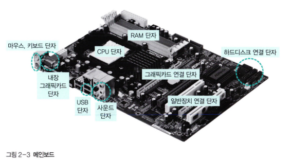

# 2장 컴퓨터의 구조와 성능 향상

# 하드웨어의 구성

- 필수장치
    - 중앙처리장치(CPU), 메인 메모리(RAM)
- 주변장치
    - 입력장치
    - 출력장치
    - 저장장치

메인메모리: 1저장장치

하드디스크, usb 메모리: 2저장장치 or 보조 저장장치

### CPU와 메모리

CPU란?  명령어를 해석하여 실행하는 장치로 인간으로 치면 두뇌에 해당한다.

메모리란? 작업에 필요한 프로그램과 데이터를 저장하는 장소로, 바이트 단위로 분할되어 있으며 분할 공간 마다 주소로 구분한다.

### 입출력장치

입력장치 = 외부의 데이터 컴퓨터에 입력하는 장치.

초기엔 천공카드를 지금은 키보드, 마우스 스캐너 등을 사용하고 있다.

출력장치 = 컴퓨터에서 처리한 결과를 사용자가 원하는 형태로 출력하는 장치

프린터, 모니터, 스피커 등이 있다.

### 저장장치

메모리는 **전자의 이동으로 데이터를 처리하기 떄문에 속도가 빠르다.** 하드디스크나 CD같은 저장장치는 구동장치가 있는 기계라서 상대적으로 속도가 느림. 

→ 대신 값이 싸다.

- 자성을 이용하는 장치
    - 카세트테이프, 플로피디스크, 하드디스크
- 레이저를 이용하는 장치
    - CD, DVD, 블루레이디스크
- 메모리를 이용하는 장치
    - USB, SD, CF, SSD

### 메인보드

CPU와 메모리 등 다양한 부품을 연결하고 전원을 공급해 주는 커다란 판.

메인보드에서 각 장치를 연결하여 데이터가 지나다니는 통로를 **버스**라고 한다.

교통수단인 버스가 정해진 경로로 다니듯이 메인보드의 버스도 **일정한 경로를 따라 각 장치에 데이터를 전송하는 역할**을 함.



# 폰노이만 구조


폰노이만 구조는 메모리를 이용하여 프로그래밍이 가능한 컴퓨터 구조이다.

즉, **하드웨어는 그대로 둔 채 작업을 위한 프로그램만 교체하여 메모리에 올리는 방식.**

예시: 워드프로세서로 보고서를 작성했다 가정. 워드 프로세서의 프로그램과 보고서 파일은 저장장치인 하드디스크에 저장. 프로그램과 데이터가 저장장치에서 바로 실행되지는 않는다. 

**저장장치에 있는 프로그램을 실행하려면 프로그램이 메모리에 올라와야 하며**, 운영체제도 프로그램이기 때문에 메모리에 올라와야 실행할 수 있다.

### 요리사 모형

- 요리사 = CPU
- 도마 = 메모리
- 보관 창고 = 저장장치

### 기초용어 정리

크기 단위

- B = 1
- KB = 1,000
- MB = 백만
- GB = 십억
- TB = 조
- PB = 천조

클록과 헤르츠

- 클록: 컴퓨터에서 일정한 박자를 만들어 내는 것
- 헤르츠: 시간에 따라 변화가 일어날 때 사용하는 단위
    - 3GHz CPU = 1초에 30억 번의 작업이 가능한 CPU
    

시스템 버스와 CPU 버스

- 시스템 버스: 메모리와 주변 장치를 연결하는 버스. 메인보드의 동작 속도를 의미
    - FSB 혹은 전면 버스라고 부른다
    - 3.2MHz는 메인보드의 버스 클록이 최대 3200MHZ라는 의미
- CPU 버스: CPU 내부에 있는 장치를 연결하는 버스
    - BSB 혹은 후면 버스라고 부름
    

프로그래밍과 언어

컴퓨터에 알려줄 작업을 하나로 모으면 **프로그램**.

→ 이 프로그램을 만들기 위해 사용하는 언어가 프로그래밍 언어

- 컴퓨터가 이해할 수 있는 언어? 0과 1로만 된 기계어
- 사람들이 이해할 수 있게 바꾼 것이 어셈블리어 → 저급언어
- 일반인이 이해할 수 있는 단어를 사용해서 만든 언어 → 고급언어
    - 자바, 파이썬 등등
- 이러한 고급언어를 기계어로 번역하는 과정을 컴파일, 컴파일을 담당하는 프로그램을 컴파일러라고 부름
    - 다른 방법으로 인터프리터가 있다. 인터프리터는 소스코드를 한 번에 한 문장씩 번역하여 실행(자바스크립트)
    

필수 자료구조

- 큐
- 스택
- 배열
- 연결리스트

# 2-2 CPU와 메모리

## CPU의 구성과 동작

CPU = 산술논리 연산장치, 제어장치, 레지스터

- 산술논리 연산장치: 데이터를 연산하는 장치. 데이터의 산술 연산과 AND, OR 같은 논리 연산 수행
- 제어장치: CPU에서 작업을 지시하는 부분
- 레지스터: 작업에 필요한 데이터를 CPU 내부에 보관하는 곳

레지스터의 종류

- 데이터 레지스터: 메모리에서 가져온 데이터를 임시로 보관할 때 사용. 대부분 데이터 레지스터이기 때문에 일반 레지스터 또는 범용 레지스터라고 부른다.
- 주소 레지스터: 데이터 또는 명령어가 저장된 메모리의 주소는 주소 레지스터에 저장된다.
- 특수 레지스터: 사용자가 임의로 변경할 수 없기 때문에 사용자 불가 레지스터라고도 불림
    - 프로그램 카운터: CPU가 다음에 어떤 명령어를 처리해야 할지 알려주는 역할. 명령어 포인터라고도함
    - 명령어 레지스터: 현재 실행 중인 명령어를 저장함. 제어장치는 명령어 레지스터에 있는 명령을 해석한 후 외부 장치에 적절한 제어 신호를 보냄.
    - 메모리 주소 레지스터: 메모리에서 데이터를 가져오거나 반대로 메모리로 데이터를 보낼 때 주소를 지정하는데 사용된다.
    - 메모리 버퍼 레지스터: 메모리에서 가져온 데이터나 메모리로 옮겨갈 데이터를 임시로 저장한다.


1. 프로그램 카운터에는 **실행해야 하는 코드 행 번호 1이 저장.** 1이 제어장치에 전송되면 1행이 실행. 명령어 레지스터에 LOAD가 탑재
2. 제어장치가 명령어 레지스터에 있는 명령 LOAD를 해석하여 메모리 100번지에 있는 데이터를 가져오라고 제어 신호를 보냄
3. 메모리 주소 레지스터에는 100이 저장된다. 메모리에 있는 데이터를 CPU로 옮기는 일은 메모리 관리자가 담당한다. 메모리 관리자는 메모리 주소 레지스터에 있는 100을 읽은 후 메모리 주소 100번지에 저장된 값 2를 메모리 버퍼 레지스터로 보낸다. 
4. 제어장치는 메모리 버퍼 레지스터에 저장된 값 2를 레지스터로 옮긴다.

이거 외에 특수 레지스터로 **상태 레지스터**가 있다. if와 같은 분기 문장에서 사용 된다.

- if 문의 결과를 임시로 저장했다가 음수인지 양수인지를 제어장치에게 알려주어 몇 번 행으로 이동할지를 결정해준다.


버스의 종류

버스란? CPU와 메모리, 주변장치 간에 데이터를 주고받을 때 사용하는 것

- 제어 버스: 다음에 어떤 작업을 할지 지시하는 제어 신호가 오고 감.
    - CPU의 제어장치와 연결되어 있다. 양방향
- 주소 버스: 메모리의 데이터를 읽거나 쓸  어느 위치에서 작업할 것인지를 알려주는 위치 정보가 오간다.
    - 메모리 주소 레지스터와 연결되어 있으며 단방향이다.
- 데이터 버스: 제어 버스가 다음에 어떤 작업을 할지 신호를 보내주고 주소 버스가 위치 정보를 전달하면 데이터가 데이터 버스에 실려 목적지까지 이동
    - 메모리 버터 레지스터와 연결되어 있으며 양방향

64bit CPU = 한번에 처리할 수 있는 데이터의 크기가 64bit라는 것.

### 메모리의 종류와 부팅

모든 프로그램은 메모리에 올라와야 실행될 수 있음.

메모리 = 읽거나 쓸 수 있는 RAM + 읽기만 가능한 ROM


- 휘발성 메모리
    - DRAM(Dynamic): 저장된 0과 1의 데이터가 일정 시간이 지나면 사라지므로 일정 시간마다 다시 재생시켜야 한다.
    - SRAM(Static): 전력이 공급되는 동안에는 데이터를 보관할 수 있어 재생할 필요가 없다.
    - 일반적으로 메인메모리에는 DRAM, 캐시 같은 고속 메모리에는 SRAM을 사용
    - SDRAM은 DRAM이 발전된 형태로 클록 틱이 발생할 때마다 데이털르 저장하는 동기 DRAM이다.
- 비휘발성 메모리
    - 플래쉬 메모리: 디지털카메라, MP3 플레이어, USB 드라이버같은 전력이 없어도 데이터를 보관하는 저장장치로 많이 사용.
    - FRAM
    - PRAM: 전용 기게를 이용하여 데이터를 한 번만 저장할 수 있다.

메모리 보호

메모리 보호를 위해 경계레지스터와 한계레지스터를 저장하고  그 주소 값 안에서만 이루어지게 함.

부팅

컴퓨터를 켰을 떄 운영체제를 메모리에 올리는 과정.


부트스트랩: 하드디스크의 첫 번째 섹터를 가리키며 운영체제를 실행하기 위한 코드.

# 컴퓨터 성능 향상 기술

버퍼: 두 장치 사이의 속도 차이를 완화하는 역할을 함.

스풀: CPU와 입출력장치가 독립적으로 동작하도록 고안된 소프트웨어적인 버퍼.

- 예: 프린터에 스풀러

캐시: 캐시는 메모리와 CPU 간의 속도 차이를 완화하기 위해 메모리의 데이터를 미리 가져와 저장해 두는 임시 장소.

- 즉시 쓰기: 캐시에 있는 데이터가 변경되면 이를 즉시 메모리에 반영하는 방식.
- 지연 쓰기: 캐시에 있는 데이터가 변경되면 그 내용을 모아서 주기적으로 반영하는 방식.

인터럽트: 요리사가 옆에 주방보조를 두는 것과 같다. 요리사는 주방 보조에게 필요한 재료를 가져오도록 지시하고 자신은 계속 요리를 한다. 지시를 받은 주방 보조는 재료를 가져다 도마에 올려놓고 재료가 준비되었다는 것을 요리사한테 알려줌.

1. CPU가 입출력 관리자에게 입출력 명령을 보낸다.
2. 입출력 관리자는 명령받은 데이터를 메모리에 가져다 놓거나 메모리에 있는 데이터를 저장장치로 옮긴다.
3. 데이터 전송이 완료되면 입출력 관리자는 CPU에 완료 신호를 보낸다.

입출력 관리자가 CPU에 보내는 완료 신호를 인터럽트라고 한다.


**메모리 맵 입출력 그림**

# 멀티 프로세싱

**멀티코어 시스템**

볶음밥 하나 만드는데 40분 2개에 80분.

→ 주방이 2개인 경우 2개에 40분

멀티코어 시스템에서는 하나의 칩에 CPU에 핵심이 되는 코어를 여러 개 만들어 여러 작업을 동시에 처리할 수 있다.

**CPU 멀티스레드**

하나의 코어에 2개 이상의 명령어를 처리하는 방법. 요리가 2명이 한 사람이 재료 손질하는 동안 다른 요리사가 재료를 볶으면 됨. 이렇게 **하나의 코어에서 여러개의 명령어를 동시에 처리하는 것을 명령어 병렬 처리라고 함.**


→ 기존방식 = 120분 → 지금 = 60분만에 3개를 만들 수 있다.

이러한 방법을 CPU 멀티스레드라고 한다.

현대의 컴퓨터는 멀티코어와 명령어 병렬 처리 기능을 한꺼번에 구현함.

멀티코어: 하나의 칩으로 CPU에 핵심이 되는 코어를 여러 개 만들어 여러 작업을 동시에 처리

명령어 병렬 처리: 하나의 코어에서 여러 개의 명령어를 동시에 처리

- 예: 인텔의 i7-3770 CPU = 4코어와 하이퍼 스레드를 지원
    - 코어 4개에 명령어 병렬 처리가 코어당 2개씩 작동하기 떄문에 논리 프로세서의 수는 8개가 되어 CPU가 8개 달린 컴퓨터

# 문제

### 문제1: 이 CPU에 대해 설명하시오


- 이 CPU는 6개의 코어에 하이퍼스레딩 기술을 지원함.

### 문제2: 이 언어는 뭐라고 하나요?


- JVM 바이트 코드이다(어셈블리어와 비슷한 명령어 집합)

### 여담

원래 자바 코드

```java
package com.cos.jwt;

import org.springframework.boot.SpringApplication;
import org.springframework.boot.autoconfigure.SpringBootApplication;
import org.springframework.context.annotation.Bean;
import org.springframework.security.crypto.bcrypt.BCryptPasswordEncoder;

@SpringBootApplication
public class JwtApplication {

    @Bean
    public BCryptPasswordEncoder passwordEncoder(){
        return new BCryptPasswordEncoder();
    }

    public static void main(String[] args) {
        SpringApplication.run(JwtApplication.class, args);
    }

}

```

바이트 코드(16진수 = Hex)

```java
0000	ca fe ba be 00 00 00 34  00 23 0a 00 02 00 03 07   .......4.#......
0010	00 04 0c 00 05 00 06 01  00 10 6a 61 76 61 2f 6c   ..........java/l
0020	61 6e 67 2f 4f 62 6a 65  63 74 01 00 06 3c 69 6e   ang/Object...<in
0030	69 74 3e 01 00 03 28 29  56 07 00 08 01 00 40 6f   it>...()V.....@o
0040	72 67 2f 73 70 72 69 6e  67 66 72 61 6d 65 77 6f   rg/springframewo
0050	72 6b 2f 73 65 63 75 72  69 74 79 2f 63 72 79 70   rk/security/cryp
0060	74 6f 2f 62 63 72 79 70  74 2f 42 43 72 79 70 74   to/bcrypt/BCrypt
0070	50 61 73 73 77 6f 72 64  45 6e 63 6f 64 65 72 0a   PasswordEncoder.
0080	00 07 00 03 07 00 0b 01  00 1a 63 6f 6d 2f 63 6f   ..........com/co
0090	73 2f 6a 77 74 2f 4a 77  74 41 70 70 6c 69 63 61   s/jwt/JwtApplica
00a0	74 69 6f 6e 0a 00 0d 00  0e 07 00 0f 0c 00 10 00   tion............
00b0	11 01 00 2a 6f 72 67 2f  73 70 72 69 6e 67 66 72   ...*org/springfr
00c0	61 6d 65 77 6f 72 6b 2f  62 6f 6f 74 2f 53 70 72   amework/boot/Spr
00d0	69 6e 67 41 70 70 6c 69  63 61 74 69 6f 6e 01 00   ingApplication..
00e0	03 72 75 6e 01 00 62 28  4c 6a 61 76 61 2f 6c 61   .run..b(Ljava/la
00f0	6e 67 2f 43 6c 61 73 73  3b 5b 4c 6a 61 76 61 2f   ng/Class;[Ljava/
0100	6c 61 6e 67 2f 53 74 72  69 6e 67 3b 29 4c 6f 72   lang/String;)Lor
0110	67 2f 73 70 72 69 6e 67  66 72 61 6d 65 77 6f 72   g/springframewor
0120	6b 2f 63 6f 6e 74 65 78  74 2f 43 6f 6e 66 69 67   k/context/Config
0130	75 72 61 62 6c 65 41 70  70 6c 69 63 61 74 69 6f   urableApplicatio
0140	6e 43 6f 6e 74 65 78 74  3b 01 00 04 43 6f 64 65   nContext;...Code
0150	01 00 0f 4c 69 6e 65 4e  75 6d 62 65 72 54 61 62   ...LineNumberTab
0160	6c 65 01 00 12 4c 6f 63  61 6c 56 61 72 69 61 62   le...LocalVariab
0170	6c 65 54 61 62 6c 65 01  00 04 74 68 69 73 01 00   leTable...this..
0180	1c 4c 63 6f 6d 2f 63 6f  73 2f 6a 77 74 2f 4a 77   .Lcom/cos/jwt/Jw
0190	74 41 70 70 6c 69 63 61  74 69 6f 6e 3b 01 00 0f   tApplication;...
01a0	70 61 73 73 77 6f 72 64  45 6e 63 6f 64 65 72 01   passwordEncoder.
01b0	00 44 28 29 4c 6f 72 67  2f 73 70 72 69 6e 67 66   .D()Lorg/springf
01c0	72 61 6d 65 77 6f 72 6b  2f 73 65 63 75 72 69 74   ramework/securit
01d0	79 2f 63 72 79 70 74 6f  2f 62 63 72 79 70 74 2f   y/crypto/bcrypt/
01e0	42 43 72 79 70 74 50 61  73 73 77 6f 72 64 45 6e   BCryptPasswordEn
01f0	63 6f 64 65 72 3b 01 00  19 52 75 6e 74 69 6d 65   coder;...Runtime
0200	56 69 73 69 62 6c 65 41  6e 6e 6f 74 61 74 69 6f   VisibleAnnotatio
0210	6e 73 01 00 2d 4c 6f 72  67 2f 73 70 72 69 6e 67   ns..-Lorg/spring
0220	66 72 61 6d 65 77 6f 72  6b 2f 63 6f 6e 74 65 78   framework/contex
0230	74 2f 61 6e 6e 6f 74 61  74 69 6f 6e 2f 42 65 61   t/annotation/Bea
0240	6e 3b 01 00 04 6d 61 69  6e 01 00 16 28 5b 4c 6a   n;...main...([Lj
0250	61 76 61 2f 6c 61 6e 67  2f 53 74 72 69 6e 67 3b   ava/lang/String;
0260	29 56 01 00 04 61 72 67  73 01 00 13 5b 4c 6a 61   )V...args...[Lja
0270	76 61 2f 6c 61 6e 67 2f  53 74 72 69 6e 67 3b 01   va/lang/String;.
0280	00 10 4d 65 74 68 6f 64  50 61 72 61 6d 65 74 65   ..MethodParamete
0290	72 73 01 00 0a 53 6f 75  72 63 65 46 69 6c 65 01   rs...SourceFile.
02a0	00 13 4a 77 74 41 70 70  6c 69 63 61 74 69 6f 6e   ..JwtApplication
02b0	2e 6a 61 76 61 01 00 3e  4c 6f 72 67 2f 73 70 72   .java..>Lorg/spr
02c0	69 6e 67 66 72 61 6d 65  77 6f 72 6b 2f 62 6f 6f   ingframework/boo
02d0	74 2f 61 75 74 6f 63 6f  6e 66 69 67 75 72 65 2f   t/autoconfigure/
02e0	53 70 72 69 6e 67 42 6f  6f 74 41 70 70 6c 69 63   SpringBootApplic
02f0	61 74 69 6f 6e 3b 00 21  00 0a 00 02 00 00 00 00   ation;.!........
0300	00 03 00 01 00 05 00 06  00 01 00 12 00 00 00 2f   .............../
0310	00 01 00 01 00 00 00 05  2a b7 00 01 b1 00 00 00   ........*.......
0320	02 00 13 00 00 00 06 00  01 00 00 00 09 00 14 00   ................
0330	00 00 0c 00 01 00 00 00  05 00 15 00 16 00 00 00   ................
0340	01 00 17 00 18 00 02 00  12 00 00 00 32 00 02 00   ............2...
0350	01 00 00 00 08 bb 00 07  59 b7 00 09 b0 00 00 00   ........Y.......
0360	02 00 13 00 00 00 06 00  01 00 00 00 0d 00 14 00   ................
0370	00 00 0c 00 01 00 00 00  08 00 15 00 16 00 00 00   ................
0380	19 00 00 00 06 00 01 00  1a 00 00 00 09 00 1b 00   ................
0390	1c 00 02 00 12 00 00 00  36 00 02 00 01 00 00 00   ........6.......
03a0	08 12 0a 2a b8 00 0c 57  b1 00 00 00 02 00 13 00   ...*...W........
03b0	00 00 0a 00 02 00 00 00  12 00 07 00 13 00 14 00   ................
03c0	00 00 0c 00 01 00 00 00  08 00 1d 00 1e 00 00 00   ................
03d0	1f 00 00 00 05 01 00 1d  00 00 00 02 00 20 00 00   ............. ..
03e0	00 02 00 21 00 19 00 00  00 06 00 01 00 22 00 00   ...!........."..
```

###