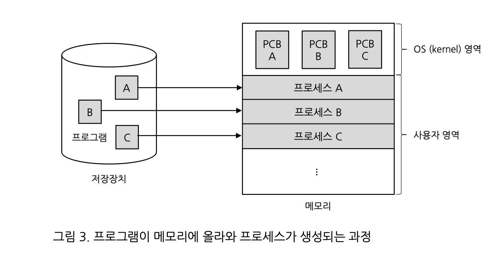

# 3장 프로세스와 스레드

# 프로세스의 개요

### 프로세스의 개념

프로그램이 실행된다는 것은 해당 코드가 메모리에 올라와서 작업이 진행된다는 의미.

즉, 프로세스는 **실행을 위해 메모리에 올라온 동적인 상태**.

- 일괄 작업 방식
    - 한 번에 한가지 일만 가능하므로 작업 효율이 떨어짐
- 시분할 작업 방식
    - 시간을 적당히 배분하여 작업의 효율을 높힘.

### 프로그램에서 프로세스로의 전환

운영체제가 프로그램을 메모리에 적당한 위치로 가져와 작업 지시서를 만드는데 이것을 **프로세스 제어 블록(PCB)**이라고 한다. PCB에는 많은 정보가 담겨 있음.

어떤 프로그램이 프로세스가 되었다? → 운영체제로부터 PCB을 받았다는 의미

PCB에 있는 다양한 정보

- 프로세스 구분자
- 메모리 관련 정보
- 각종 중간값



즉, **프로세스 = 프로그램 + 프로세스 제어 블록**

### 프로세스 상태

생성, 실행, 완료 중 하나가 된다.


- 생성 상태: 프로세스가 메모리에 올라와 실행 준비를 완료한 상태
- 준비 상태: 생성된 프로세스가 CPU를 얻을 때까지 기다리는 상태.
- 실행 상태: CPU를 얻어 실제 작업을 수행하는 상태
- 완료 상태: 실행 상태의 프로세스가 주어진 시간 동안 작업을 마치면 완료 상태로 진입. 완료 상태는 프로세스 제어 블록이 사라진 상태를 의미.
- 대기 상태: 실행 상태에 있는 프로세스가 입출력을 요청하면 입출력이 완료 될 때까지 기다리는 상태이다. 입출력이 완료되면 준비 상태로 이동.

**조금 특별한 경우 사용하는 상태**

- 휴식 상태: 프로세스가 작업을 일시적으로 쉬고 있는 상태
- 보류 상태: 프로세스가 **메모리에서 잠시 쫓겨난 상태**로 휴식 상태와 차이가 있다. 대개 컴퓨터의 성능을 떨어뜨리거나 실행을 미루어도 큰 지장이 없는 프로세스가 해당된다.

# 프로세스 제어 블록과 문맥 교환

## 프로세스 제어 블록

PCB는 프로세스를 실행하는데 필요한 중요한 정보를 교환하는 자료구조로 TCB(Task Control Block)이라고도 한다. 프로세스 실행이 완료되면 폐기

- 포인터
- 프로세스 상태
- 프로세스 구분자
- 프로그램 카운터
- 프로세스 우선순위
- 각종 레지스터 정보
- 메모리 관리 정보
- 할당된 자원 정보
- 계정 정보
- 부모 프로세스 구분자와 자식 프로세스 구분자

### 문맥 교환

문맥 교환은 CPU를 차지하던 프로세스가 나가고 새로운 프로세스를 받아들이는 작업을 말한다.

실행 상태에서 나가는 프로세스 제어 블록에는 지금까지의 작업 내용을 저장하고, 반대로 실행 상태로 들어오는 프로세스 제어 블록의 내용으로 CPU가 다시 세팅된다.


결국 문맥 교환을 하면서 **타임 슬라이스가 발생**하게 된다. 타임 슬라이스를 너무 작게 설정하면 시스템의 성능이 떨어지고 타임 슬라이스를 너무 크게 설정하면 끊겨 보이기에 적당한 시간인 100밀리초로 보통은 설정한다.

# 프로세스의 연산

프로세스의 구조 = 코드 영역(요리책) + 데이터 영역(재료) + 스택 영역(조리 도구)

- 코드 영역: 프로그램의 본문이 기술된 곳. 프로그래머가 작성한 프로그램은 코드 영역에 탑재되며 읽기 전용으로 처리됨.
- 데이터 영역: 코드가 실행되면서 사용하는 변수나 파일 등의 각종 데이터를 모아놓은 곳. 데이터는 변하는 값이기 때문에 이곳의 내용은 기본적으로 읽기와 쓰기가 가능하다.
- 스택 영역: 운영체제가 프로세스를 실행하기 위해 부수적으로 필요한 데이터를 모아놓은 곳. 스택 영역은 운영체제가 사용자의 프로세스를 작동하기 위해 유지하는 영역이므로 사용자에게는 보이지 않는다.

### 프로세스의 생성과 복사

프로세스는 프로그램을 실행할 때 새로 생성. 프로세스의 생성 방법에는 프로세스를 새로 생성하는 방법 외에 **실행 중인 프로세스에서 새로운 프로세스를 복사하는 방법**도 있다.

**fork()시스템 호출 개념**

fork() 시스템 호출은 실행 중인 프로세스로부터 새로운 프로세스를 복사하는 함수로 커널에서 제공한다.

- fork()는 실행 중인 프로세스를 복사하는 함수다. 이때 실행하던 프로세스는 부모 프로세스, 새로 생각 프로세스는 자식 프로세스로서 둘은 부모-자식 관계가 된다.


- 프로세스 구분자(PID)가 바뀐다. 부모와 자식이 주민등록번호가 다른 것과 같음.
- 서로 차지하는 메모리의 위치가 다르므로 메모리 관련 정보가 바뀐다.
- 부모 프로세스 구분자와 자식 프로세스 구분자가 바뀐다.

**fork() 시스템 호출의 장점**

- 프로세스의 생성 속도가 빠르다.
- 추가 작업 없이 자원을 상속할 수 있다.
- 시스템 관리를 효율적으로 할 수 있다.

### 프로세스의 전환

운영체제는 주문하는 요리가 달라도 간단하게 처리하는 기능을 제공하는데 fork() 시스템 호출로 요리를 복사한 후, 복사된 요리를 새로운 요리로 바꾸는 함수인 exec() 시스템 호출을 사용하면 된다.

**exec() 시스템 호출의 개념**

exec() 시스템 호출은 기존 프로세스를 새로운 프로세스로 전환하는 함수. 프로세스는 그대로 둔 채 내용만 바꾸는 시스템 호출. 즉, **현재의 프로세스가 완전 다른 프로세스로 전환**된다.

→ 이미 만들어진 프로세스 제어 블록, 메모리 영역, 부모-자식 관계를 그대로 사용할 수 있어 편리.

**exec() 시스템 호출의 동작 과정**

exec() 시스템 호출을 하면 코드 영역에 있는 기존 내용이 지워지고 새로운 코드로 바뀐다. 또한 데이터 영역이 새로운 변수로 채워지고 스택 영역이 리셋된다. 

- 바뀌지 않는 것 : 프로세스 구분자, 부모 프로세스 구분자, 자식 프로세스 구분자, 메모리 관련 사항
- 바뀌는 것: 프로그램 카운터 레지스터 값을 비롯한 각종 레지스터, 사용한 파일 정보

마치 처음 사시작하는 것처럼 내용이 정리 됨.

## 프로세스의 계층 구조

**유닉스의 프로세스 계층 구조**


init 프로세스는 일반 사용자 프로세스의 맨 위에 위치하며, fork()와 exec() 시스템 호출을 이용하여 자식 프로세스를 만든다.

**프로세스 계층 구조의 장점**

동시에 여러 작업을 처리하고 종료된 프로세스의 자원을 회수하는데 유용하다.

- 여러 작업의 동시 처리
    - 예시: 사용자 3명이 동시에 컴퓨터에 접속한다? → fork()로 login 프로세스를 여러 개 만들어서 사용자에게 나누어 준다.
- 용이한 자원 회수
    - 모든 프로세스를 부모-자식 관계로 만들면 자식 프로세스가 작업을 마쳤을 때 사용하던 자원을 부모 프로세스가 회수하면 된다.

**고아 프로세스와 좀비 프로세스**

고아 프로세스: 자식 프로세스가 종료되기 전에 부모 프로세스가 먼저 종료된 것

좀비 프로세스: 자식 프로세스가 종료되었는데도 부모 프로세스가 뒤처리를 하지 않을때 발생

→ 좀비 프로세스가 메모리를 차지하기 때문에 보통 컴퓨터가 느려진다.

# 스레드

스레드의 정의: 프로세스의 코드에 정의된 절차에 따라 CPU에 작업 요청을 하는 실행 단위다.

### 프로세스와 스레드의 차이

프로세스끼리는 **약하게 연결**, 스레드끼리는 **강하게 연결**되있다.

- 멀티태스크: 워드프로세서와 프린터 스플러. 워드프로세서와 프린터 스플러는 서로 독립적으로 작동하다가 필요할 때 출력할 데이터를 주고 받는다. 즉, **워드 프로세서가 비정상적으로 종료되어도 프린터 스플러는 정상적으로 작동**한다. 이렇게 서로 독립적인 프로세스는 데이터를 주고받을 때 프로세스 간 통신을 이용한다.
    - 운영체제가 CPU에 작업을 줄 때 시간을 잘게 나누어 배분하는 기법.
- 멀티스레드: 워드프로세서 프로세스 내의 문서 편집, 문서 입출력, 맞춤법 검사, 그림판 같은 스레드들이 동시에 작업을한다. 이러한 **스레드들은 강하게 연결되어 워드프로세서가 비정상적으로 종료하면 프로세스 내의 스레드도 강제 종료**된다.
    - 즉, **프로세스 내 작업을 여러 개의 스레드로 분할함으로써 작업의 부담을 줄이는 프로세스 운영 기법**
- 멀티 프로세싱: CPU를 여러 개 사용하여 여러 개의 스레드를 동시에 처리하는 작업 환경을 말한다. 컴퓨터 하나에 CPU가 여러 개 설치되어 동시에 작동하는 것이 멀티 프로세싱.
    - 하나의 CPU 내 여러 개의 코어에 스레드를 배정하는 동시에 작동하는 것도 멀티 프로세싱
- CPU 멀티스레드
    - 운영체제가 소프트웨어적으로 프로세스를 작은 단위의 스레드로 분할하여 운영하는 기법은 멀티스레드, **하나의 CPU에서 여러 스레드를 동시에 처리하는 것은 CPU 멀티스레드**라고 부른다.

### 멀티스레드의 구조와 예

**멀티스레드의 구조**

프로세스는 크게 정적인 영역과 동적인 영역으로 구분됨. 

정적인 영역 = 프로세스가 실행하는 동안 바뀌지 않는 영역

동적인 영역 = 스레드가 작업을 하면서 값이 바뀌거나 새로 만들어지거나 사라지는 영역(레지스터 값, 스택, 힙 등)

과거에는 프로세스 하나 = 스레드하나. 여러 작업을 하려면? → fork() 시스템 호출로 여러 개의 프로세스를 만듬

요즘에는 fork() 시스템 호출 대신 **하나의 프로세스에 여러 개의 스레드를 만들어서 사용**


이렇게 멀티스레드를 사용하면 하나의 워드프로세서에 스레드를 여러 개 생성하여 문서를 편집할 때 **낭비를 줄이고 자원을 효율적으로 사용할 수 있다**.

### 멀티스레드의 장단점

멀티스레드의 장점

- 응답성 향상: 한 스레드가 입출력으로 인해 작업이 직행되지 않더라도 다른 스레드가 작업을 계속하여 사용자의 작업 요구에 빨리 응답할 수 있다.
- 자원 공유: 자원의 중복 사용을 피함으로써 낭비를 막을 수 있다.
- 효율성 향상: 하나의 프로세스에서 여러 스레드를 사용하면 작업의 효율을 높일 수 있다.
- 다중 CPU 지원: 2개 이상의 CPU를 가진 컴퓨터에서 멀티스레드를 사용하면 다중 CPU가 멀티스레드를 동시에 처리하여 CPU 사용량이 증가하고 프로세스의 처리 시간이 단축 된다.

멀티스레드의 단점

- 멀티스레드의 경우 한 스레드에 문제가 생기면 전체 프로세스에 영향을 미침.

요즘은 메모리도 넉넉하고 멀티코어 CPU가 대중화되어 여러 개의 프로세스를 여러 개의 CPU에서 동시에 실행할 수 있게 됨.

### 멀티스레드 모델

스레드 = 커널 스레드 + 사용자 스레드

**사용자 스레드(1 : N 모델)**

넷플릭스 아이디를 여러 사람이 돌아가면서 사용하는 경우


**커널 스레드(1 : 1 모델)**

하나의 사용자 스레드가 하나의 커널 스레드와 연결.


멀티레벨 스레드(M : N 모델)

사용자 스레드와 커널 스레드를 혼합한 방식.


# 동적 할당 영역과 시스템 호출

### 프로세스의 동적 할당 영역

프로세스= 코드 영역, 데이터 영역, 스택 영역


- 코드 영역 = 프로그램의 본체가 있는 곳
- 데이터 영역 = 프로그램이 사용하려고 정의한 변수와 데이터가 있는 곳

→ 따라서 두 영역은 프로세스가 실행되기 직전에 위치와 크기가 결정되어 변하지 않으므로 **정적 할당 영역**이라고 부른다.

스택 영역과 힙 영역은 프로세스가 실행하는 동안 만들어지는 영역으로 **동적 할당 영역**이다.


1. 호출한 함수가 종료되면 함수를 호출하기 전 코드로 되돌아와야 하는데 되돌아올 메모리 주소를 스택에 저장한다.
2. 스택은 변수 사용 범위에 영향을 미치는 영역을 구현할 때 사용된다. 변수는 전역 변수와 지역 변수로 나뉘는데, 전역 변수는 프로그램 내에 있는 모든 함수에서 사용할 수 있고 지역 변수는 특정 함수에서만 사용할 수 있다. 지역 변수는 함수가 호출될 때만 사용되다가 함수가 종료되면 사용한 공간을 반환해야하는데 이를 저장할 때 스택을 사용

**힙 영역**

힙은 동적으로 할당되는 변수 영역. 대부분의 데이터는 데이터 영역에 할당되고 그 크기가 정해진다. 그러나 일부 데이터는 프로그램이 실행되는 동안 할당되는데 대표적인 경우가 malloc() 함수.

### exit()과 wait() 시스템 호출

exit() 함수는 작업의 종료를 알려주는 시스템 호출이다. 

exit()함수를 이용하여 프로세스를 종료할 때 자식보다 부모가 먼저 종료되어 고아 프로세스가 생기는 것을 방지하기 위해 wait() 시스템 호출을 사용한다.

# 문제

### 문제1: 이 그림을 보고 스풀에 대하여 설명하고 스풀은 멀티태스크인지 멀티스레드인지 말하시오.


- 스풀이란 CPU와 입력장치가 독립적으로 실행되도록 하는 소프트웨어적 버퍼를 의미하며 멀티테스크이다. (멀티스레드는 독립적이지 X)

### 문제2: 밑의 코드를 보고 호출 스택에 대해 설명하시오.

```java
class CallStackTest {
	public staic void main(String[] args) {
    	firstMethod();
    }
    static void firstMethod() {
    	secondMethod();
    }
    static void secondMethod() {
    	System.out.println("secondMethod()");
    }
}
```

