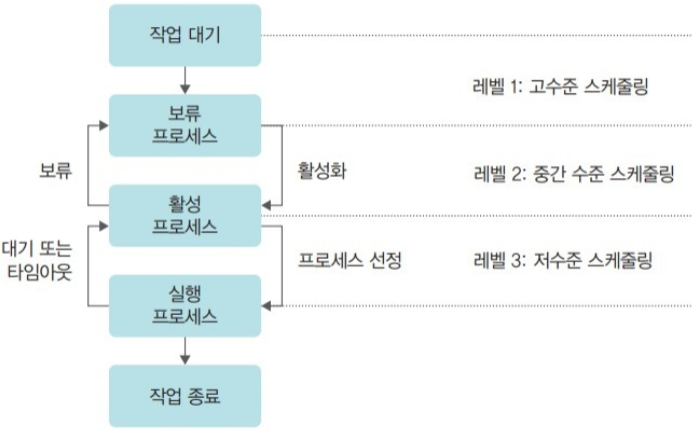

# 4장 CPU 스캐줄링

# 스캐줄링의 개요

### CPU 스케줄링

- 고수준 스케줄링: 가장 큰 틀에서 이루어지는 CPU 스케줄링.
    - **시스템 내의 전체 작업 수를 조절**하는 것
    - 고수준 스케줄링에 따라 시스템 내에서 동시에 실행 가능한 프로세스의 총 개수가 정해짐.
    - 고수준 스케줄링은 메인프레임과 같은 큰 시스템에서 규모가 큰 일괄 작업을 처리할 때 사용
- 저수준 스케줄링: 가장 작은 단위의 스케줄링. **어떤 프로세스에 CPU를 할당할지, 어떤 프로세스를 대기 상태로 보낼지 등을 결정하는 일**
    - 저수준 스케줄링에서는 실제로 작업이 이루어진다.
- 중간 수준 스케줄링: 고수준과 저수준 스케줄링 사이에 일어나는 스케줄링.
    - **중지와 활성화로 전체 시스템 활성화된 프로세스 수를 조절**하여 과부하를 막는다.
    - 일부 프로세스를 중지 상태로 옮김으로써 나머지 프로세스가 원만하게 작동하도록 지원

### 스케줄링의 목적

모든 프로세스가 공평하게 작업하도록 하는 것

- 공평성
- 효율성
- 확장성
- 반응 시간 보장
- 무한 연기 방지

모든 프로세스가 공평하게 CPU를 할당받아야 하지만 **시스템의 안정성과 효율성을 높이기 위해서는 먼저 처리해야하는 프로세스가 있으므로 cpu 스케줄러는 일정 부분 공평성을 희생**한다.

# 스케줄링 시 고려 사항

### 선점형 스케줄링과 비선점형 스케줄링

- 선점형 스케줄링: 어떤 프로세스가 CPU를 할당받아 실행 중이더라도 **운영체제가 CPU를 강제로 빼앗을 수 있는 스케줄링 방식**
    - 대표적인 예로 **인터럽트 처리** → CPU가 인터럽트를 받으면 현재 실행 중인 작업을 중단하고 커널을 깨워서 인터럽트를 처리
    - 문맥 교환 같은 부가적인 작업으로 인해 낭비가 생긴다는 단점이 있다.
    - 빠른 응답을 요구하는 대화형 시스템이나 시분할 시스템에 적합
- 비선점형 스케줄링: 어떤 프로세스가 CPU를 점유하면 **다른 프로세스가 이를 빼앗을 수 없는 스케줄링 방식**
    - 스케줄러의 작업량도 적고 문맥 교환에 의한 낭비도 적다
    - 그러나 **전체 시스템의 처리율이 떨어짐**

### 프로세스 우선순위

시스템에 다양한 우선순위의 프로세스가 공존하며, 우선순위가 높은 프로세스가 CPU를 먼저 차지함.

### CPU 집중 프로세스와 입출력 집중 프로세스

프로세스는 CPU를 사용하여 작업하는 실행 상태 또는 입출력을 요청하여 완료되기까지 기다리는 대기 상태가 있다. 이때 CPU를 할당 받아 실행하는 작업을 CPU 버스트, 입출력 작업을 입출력 버스트라고 함.

프로세스는 위에서 언급한 작업 형태에 따라 **CPU 집중 프로세스**와 **입출력 집중 프로세스**로 나눠 짐.

**스케줄링을할 때 입출력 집중 프로세스의 우선 순위를 높히면 시스템 효율이 향상**된다.

### 전면 프로세서와 후면 프로세서

- 전면 프로세서
    - GUI를 사용하는 운영체제에서 환면의 맨 앞에 놓인 프로세스를 말한다.
    - 예: 워드 프로세서
    - 후면 프로세서보다 우선순위가 높다
- 후면 프로세서
    - 사용자와 상호 작용이 없는 프로세스
    - 예: 압축 프로그램

# 다중 큐

### 준비 상태의 다중 큐

그림과 같이 우선순위에 따라 여러 개의 큐를 만들어 일일이 찾지 않는다.

프로세스의 우선순위를 배정하는 방식

- 고정 우선순위 방식: 운영체제가 프로세스의 우선순위를 부여하면 프로세스가 끝날 때까지 바뀌지 않는 방식
- 변동 우선순위 방식: 프로세스 생성 시 부여받은 우선순위가 프로세스 작업 중간에 변하는 방식

### 대기 상태의 다중 큐

같은 장치의 입출력을 기다리는 프로세스의 프로세스 제어 블록을 동일한 입출력 큐에 모은다.

# 스케줄링 알고리즘

- 비선점형 알고리즘: CPU를 할당받으면 작업이 끝날 때까지 CPU를 놓지 않아서 효율이 너무 떨어져 사용 X
    - FCFS 스케줄링, SJF 스케줄링, HRN 스케줄링
- 선점형 알고리즘: 시분할 시스템을 고려하여 만든 알고리즘. 어떤 프로세스가 CPU를 할당 받아 실행 중이라도 운영체제가 CPU를 강제로 뺴앗을 수 있다.
    - 라운드 로빈 스케줄링, SRT 스케줄링, 다단계 큐 스케줄링, 다단계 피드백 큐 스케줄링
- 다 되는거 : 우선순위 스케줄링

### 슼케줄링 알고리즘의 선택 기준

- CPU 사용률
- 처리량
- 대기 시간
- 응답 시간
- 반환 시간

- 대기 시간: 프로세스가 생성된 후 실행되기 전까지 대기하는 시간
- 응답 시간: 첫 작업을 시작한 후 첫 번째 출력이 나오기까지 걸린 시간
- 실행 시간: 프로세스 작업이 시작된 후 종료되기까지 걸리는 시간
- 반환 시간: 대기 시간을 포함하여 실행이 종료될 때까지 걸리는 시간

보통 스케줄링 알고리즘의 성능을 비교할때 평균 대기 시간을 보는데 **작업 패턴을 바꾸면 평균 대기 시간이 변경**되기도 한다. 그렇기 때문에 절**대적인 성능 지표로 보지 말자.**

### FCFS 스케줄링(First Come First Served)

준비 큐에 도착한 순서대로 CPU를 할당하는 비선점형 방식. 선입선출 스케줄링이라고도 한다.

### SJF 스케줄링(Shortest Job First)

프로세스에 CPU를 배정할 때 시간이 오래 걸리는 작업이 앞에 있고 간단한 작업이 뒤에 있으면 그 순서를 바꾸어 실행.

하지만 잘 사용되지 않는다.

1. 운영체제가 프로세스의 종료 시간을 정확하게 예측하기 어려움.
    1. 예: 워드프로세서를 언제 종료할지 모름. 그러므로 프로세스의 작업 긜이를 추정하기 어려움.
2. SJF 알고리즘은 공평성에 위배된다.
    1. 작업 시간이 길다는 이유만으로 뒤로 가는 것은 공평성이 현저히 떨어지기 때문.

### HRN 스케줄링(Highest Response Ratio Next)

SJF 스케줄링에서 발생할 수 있는 아사현상을 해결하기 위해 만들어진 비선점형 알고리즘으로 최고 응답율 우선 스케줄링이라고 한다. HRN 스케줄링은 서비스를 받기 위해 기다린 시간과 CPU 사용 기간을 고려하여 스케줄링 하는 방식

- 우선순위 = (대기 시간 + CPU 사용 시간) / (CPU 사용 기간)

우선 순위가 높을 수록 먼저 실행된다.

### 라운드 로빈 스케줄링(Round Robin)

순환 순서 방식. 한 프로세스가 할당받은 시간 동안 작업을 하다 완료하지 못하면 준비 큐의 맨 뒤로 가서 자기 차례를 기다리는 방식. 

라운드 로빈 스케줄링 같은 선점형 방식에서는 프로세스가 CPU를 일정 시간 동안 사용한 후 다른 프로세스에 넘겨주어야 하므로 앞의 긴 작업을 무작정 기다리는 콘보이 효과가 줄어든다.

### SRT 우선 스케줄링(Shortest Remaing Time)

남은 작업 시간이 적은 프로세스에 CPU를 먼저 할당한다.

SJF와 마찬가지로 프로세스의 종료 시간을 예측하기 어렵고 아사 현상이 일어나기 때문에 잘 사용하지 않는다.

### 우선순위 스케줄링

말 그대로 프로세스의 중요도에 따라 우선순위를 메기고 그 순서대로 실행해줌.

비선점형과 선점형에 모두 적용 가능

### 다단계 큐 스케줄링

다단계 큐 스케줄링은 우선순위에 따라 준비 큐를 여러 개 사용하는 방식. 프로세스는 운영체제로부터 부여받은 우선순위에 따라 다단계로 나뉘고, 각각의 큐는 라운드로빈으로 운영된다.

우선 순위가 높은 상위 큐 프로세스의 작업이 끝나기 전에 하위 프로세스의 작업을 할 수 없어서 나온게 다단계 피드백 큐 스케쥴링이다.

### 다단계 피드백 큐 스케줄링

CPU를 사용한 후 프로세스의 우선 순위가 낮아진다. CPU를 사용한 후의 프로세스는 원래의 큐로 되돌아가지 않고 우선순위가 하나 낮은 큐의 끝으로 들어간다.

즉, 다단계 피드백 큐 스캐줄링에서는 **프로세스가 CPU를 한 번씩 할당받아 실행될 때마다 프로세스의 우선 순위를 낮춤**으로써, 다단계 큐에서 **우선순위가 낮은 프로세스의 실행이 연기되는 문제를 완화**함.

다단계 피드백 큐 스케줄링은 오늘날 운영체제가 CPU를 스케줄링할 때 일번적으로 사용하는 방식.

# 인터럽트 처리

입출력을 요청하고 입출력이 완료되면 이벤트를 발생시켜 이 사실을 알려주는 것을 인터럽트라고 함

### 동기적 인터럽트와 비동기적 인터럽트

- 동기적 인터럽트: 실행 중인 명령어로 인해 발생하는 인터럽트
    - 프로그램 문제 때문에 발생하는 인터럽트
    - 컴퓨터가 작업자가 의도적으로 프로세스를 중단하기 위해 발생시킨 인터럽트
    - 입출력장치 같은 주변장치의 조작에 의한 인터럽트
    - 산술 연산 중 발생하는 인터럽트
- 비동기적 인터럽트: 명령어와 무관하게 발생하는 인터럽트
    - 하드디스크 읽기 오류
    - 메모리 불량

### 인터럽트 처리 과정

시스템에는 많은 인터럽트가 존재하고 각각의 인터럽트에는 고유 번호(윈도우에 IRQ)가 있다.

시스템에 인터럽트가 발생하면 IRQ로 인터럽트를 식별

인터럽트가 발생하면 인터럽트 벡터의 번호에 따라 인터럽트를 처리 한다.

### 인터럽트와 이중 모드

커널 모드와 사용자모드를 전환하며 일 처리하는 것을 이중 모드라고 한다.

이중 모드는 운영체제가 자원을 보호하기 위해 사용하는 기법

사용자가 커널 모드로 진입하는 경우는 두 가지.

1. 시스템 호출을 사용한 경우
    1. 사용자가 원해서 진입하는 것이기 때문에 **자발적**
2. 인터럽트를 사용한 경우
    1. 인터럽트에 의해 커널 모드로 진입하는 것은 **비자발적**
    2. 잘못된 명령을 수행하여 동기적 인터럽트가 발생한 것이므로 **강제 종료**됨.

# 문제

### 문제1: 윈도우의 스케줄링은 무엇인가요?

**우선순위 기반의 선점형 스케줄링**

### 문제2: 밑의 답을 맞추시오

3