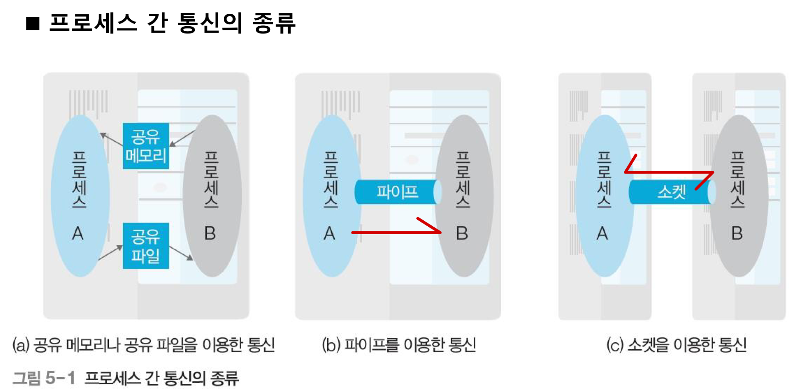

# 5장 프로세스 동기화

# 프로세스 간 통신의 개념

프로세스나 스레드가 협업하거나 여러 데이터를 병렬로 처리하기 위해서는 데이터를 주고 받아야 한다. 하나의 프로세스에 속한 스레드끼리 데이터를 주고받는 것은 쉽지만 프로세스 간 통신은 어렵다.

→ 이를 운영체제가 해결해주는데 프로세스 간 통신(IPC: Inter Process Communication)이라 한다.

- 공유 메모리나 공유 파일을 이용한 통신
    - 프로세스 간 통신 중 가장 원시적인 방식
    - 이 방식에서는 일정한 메모리 영역이나 파일을 공유하고 이를 통하여 데이터를 주고 받는다.
    - 데이터를 주고 받는 방법을 **프로세스끼리 알아서 결정**해야 하기 때문에 원시적인 방식
- 파이프를 이용한 통신
    - 하나의 컴퓨터 내에서 프로세스 간 통신에 많이 사용되는 수단으 파이프
    - 파이프는 프로세스 간 통신을 위하여 운영체제가 제공하는 통신 기법
    - 보통의 경우 파이프는 **fork()로 만들어진 부모-자식 간의 통신**에 사용 됨.
- 소켓을 이용한 통신
    - 컴퓨터와 컴퓨터가 네트워크로 연결된 경우의 통신에 주로 사용되는 수단은 소켓
    - 소켓은 네트워크로 연결된 컴퓨터에서 데이터를 주고받기 위한 통신 기법

통신 = 주고(send) + 받고(receive)

### 프로세스 간 통신의 분류

통신은 데이터가 전송되는 방향에 따라 양방향 통신, 반양방향 통신, 단방향 통신으로 나뉜다.

- 양방향 통신: 양쪽 방향으로 동시에 전송할 수 있는 구조. 일반적인 통신은 모두 양방향 통신. 프로세스 간 통신에서는 소켓을 이용한 통신이 양방향 통신에 해당
- 반양방향 통신: 데이터를 양쪽 방향으로 전송할 수 있지만 동시 전송은 불가능하고 특정 시점에 양쪽 방향으로만 전송할 수 있는 구조. 대표적으로 무전기
- 단방향 통신: 모스 부호처럼 한쪽 방향으로만 데이터를 전송할 수 있는 구조.

**바쁜 대기**란? 상태 변화를 살펴보기 위해 반복문을 무한 실행하며 기다리는 것. 

→ 자원 낭비가 크기 때문에 안 좋은 프로그램의 전형적인 예가 된다.

→ 이 문제를 해결하기 위해 데이터가 도착했음을 알려주는 **동기화**를 사용한다.

→ 대기가 있는 통신 = 동기화를 지원 / 대기가 없는 통신 = 동기화를 지원하지 않는 방법

### 프로세스 간 통신의 종류

- open(): 파일을 읽기와 쓰기를 할 수 있는 형태로 준비해 줌
- write(): 쓰기를 하겠다는 것
- read(): 쓰기를 한 것을 저장하라는 뜻
- close(): 파일을 닫겠다는 것

프로세스가 입출력 관리 프로세스에 쓰기를 요구 → 데이터가 저장

읽기를 요구 → 데이터를 가져온다.

운영체제 입장에서 보면 저장장치의 데이털르 읽고 쓰는 것도 일반 프로세스와 입출력 프로세스 간의 통신.

### 파이브를 이용한 통신

프로세스 동기화 문제를 해결하는 방법으로는 파이프를 사용. 파이브를 이용한 동신은 운영체제가 제공하는 동기화 통신 방식으로, 파일 입출력과 같이 open() 함수로 기술자를 얻어 작업한 후 close()함수로 마무리한다.

- 이름 없는 파이프: 일반적인 파이프. 부모와 자식 프로세스 혹은 같은 부모를 가진 자식 프로세스와 같이 서로 관련 있는 프로세스 간 통신에 사용된다.
- 이름 있는 파이프: FIFO라 불리는 특수 파일을 이용하며 서로 관련 없는 프로세스 간 통신에 사용된다.

### 소켓을 이용한 통신

여러 컴퓨터에 있는 프로세스끼리 통신하는 것을 네트워킹이라고 하는데 이때 소켓을 이용한 통신이 사용된다. 인터넷을 사용하려면 TCP/IP, 즉 IP와 TCP가 있어야 한다. 인터넷에서 IP의 역할은 목적지까지 데이털르 전송하는 것이며 이때 사용되는 주소가 IP 주소다.

→ 각 서버로부터 컴퓨터에 도착하는 모든 데이터의 IP주소를 같다. 따라서 하나의 컴퓨터 내에서 네트워크를 사용하는 각 프로세스를 구분할 주소가 필요한데 이것을 **포트 번호**라고 한다.

포트 번호는 TCP가 네트워크를 사용하는 프로세스를 구분하기 위해 사용하는 주소.

- IP 주소 = 아파트의 동 번호
- 포트 번호 = 해당 동의 호수

서버 쪽의 웹(80번) 포트에 방문하려는 클라이언트가 여러 명인데 한 클라이언트가 80번 포트를 장악하면 나머지 클라이언트들은 하염없이 기다려야 한다. **하나의 포트에 여러 클라이언트를 연결하려면 소켓이 필요**하다. 클라이언트들은 포트에 연결된 멀티 소켓에 하나씩 연결됨.

# 공유 자원과 임계구역

### 공유 자원에 대한 접근

공유 자원은 여러 프로세스가 공동으로 이용하는 변수, 메모리, 파일 등을 말한다. 공유 자원은 공동으로 이용되기 때문에 누가 언제 데이터를 읽거나 쓰느냐에 따라 그 결과가 달라질 수있다.

따라서 프로세스들은 **공유 자원 접근 순서를 정하여 예상치 못한 문제가 발생하지 않도록 해야함.**

이렇게 2개 이상의 프로세스가 공유 자원을 병행해서 읽거나 쓰는 상황을 **경쟁 조건**이라고 한다.

경쟁 조건이 발생되면 지금과 같이 공유 자원 접근 순서에 따라 실행 결과가 달라질 수 있다. (25만원이어야하는데 20만원으로 저장됨)

### 임계구역

공유 자원 접근 순서에 따라 실행 결과가 달라지는 프로그램의 영역을 임계구역 이라고 한다.

위의 예시에서 **예금을 확인하고 입근한 후에 예금을 저장하는 부분이 임계구역**이다.

→ 임계구역에서는 프로세스들이 동시에 작업하면 안된다. 한 프로세스가 임계구역에 들어가면 다른 프로세스는 임계구역 밖에서 기다려야함.

### 생산자-소비자 문제

전역 변수에 타이밍이 안맞을때 값이 이상해지는 상황을 말함.

이렇게 공유 자원 한 번에 한 프로세스만 사용해야한다.

### 임계구역 문제 해결 조건

임계구역 문제를 해결하기 위해서는 3가지 조건을 만족해야한다.

- 상호 배제(mutual exclusion): 한 프로세스가 임계구역에 들어가면 다른 프로세스는 임계구역에 들어갈 수 없다.
- 한정 대기(bounded waiting) : 어떤 프로세스도 임계구역에 진입하지 못하여 무한 대기 하지 않아야한다.
- 진행의 융통성(progress flexibility): 한 프로세스가 다른 프로세스의 진행을 방해해서는 안된다.

# 임계구역 문제 해결 방법

가장 단순한 방법 잠금(lock)사용

이러한 방법은 while문을 실행하고 나서 곧바로 lock=true로 실행하기 전에 다른 프로세스가 실행하게 된다면 둘 다 임계구역에 진입하여 **상호 배제 조건을 보장하지 못함. 또한 while문으로 계속 무한 루프를 돌아 시스템 자원을 낭비한다.**

### 한정 대기 문제

이 프로세스는 상호 배제가 보장된다. 하지만 두 프로세스가 모두 **임계구역에 진입하지 못하는 무한 대기 현상**이 일어날 수 있다.

1. p1이 lock1=true 문을 실행한 후 타임아웃이 발생되 p2가 실행 상태로 바뀜
2. p2 lock2 = true 문을 실행한 후 타임아웃이 발생되 p1이 실행 상태로 바뀜
3. p2가 lock2= true 문을 실행했기 때문에 p1은 while문에서 무한 루프에 빠짐
4. p1이 lock1 = true 문을 실행했기 때문에 p2도 무한 루프에 빠짐

이는 한정 대기 조건을 보장하지 못하는 상황으로 **교착 상태**에 빠졌다고 한다.

### 진행의 융통성 문제

코드에서 잠금을 확인하는 문장이 하나이므로 상호 배제와 한정 대기를 보장.

그러나 서로 번갈아가면서 실행되기에 한 프로세스가 두 번 연달아 임계구역에 진입하고 싶어도 그럴 수 없음. 

### 피터슨 알고리즘

상호배제를 충족하는 코드와 유사하지만 turn이라는 공유 변수를 하나 더 사용한다.

피터슨 알고리즘은 임계구역 문제 해결의 세 가지 조건을 모두 만족하지만 **2개의 프로세스만 사용한다는 한계**가 있다.

### 데커 알고리즘

1. P1은 우선 잠금을 건다
2. P2의 잠금이 걸렸나 확인한다.
3. P2가 잠근이 걸렸으면 누가 먼저인지 확인. 만약 P1의 차례라면 임계구역으로 진입하고 P2의 차례라면 4번 실행
4. P1은 잠금을 풀고 P2가 작업을 마칠 때까지 기다린다. P2가 작업을 마치면 잠금을 걸고 임계구역으로 진입

### 세마포어

세마포어 알고리즘은 프로세스가 임계구역에 진입하기 전에 스위치를 사용 중으로 놓고 임계구역으로 들어간다. 이후에 도착하는 프로세스는 앞의 프로세스가 작업을 마칠 때까지 기다린다. 프로세스가 작업을 마치면 세마포어는 다음 프로세스에 임계구역을 사용하라는 동기화 신호를 보낸다.

- Semaphore(n)은 n은 공유 가능한 자원의 수.
- p(): 잠금을 수행하는 코드로 0보다 크면 1만큼 감소시키고 임계구역에 진입. 0보다 작으면 0보다 커질 때까지 기다림. block()은 wake_up()이 신호를 보낼 떄까지 기다리는 함수
- v(): 잠금 해제와 동기화를 같이 수행하는 코드로, 세마포어에서 기다리는 프로세스에 임계구역에 진입해도 좋다는 wake_up() 신호를 보낸다

1. P1이 임계구역에 진입. RS 값은 1이므로 1을 감소시키고 임계구역에 진입
2. 나중에 도착한 P2는 현재 RS 값이 0이므로 프로세스 P1이 임계구역에 빠져나올 때까지 세마포어 큐에서 기다린다.
3. P1은 현재 예금이 10만 원인 것을 확인하고 10만 원을 더해 20만원으로 바꾼 다음 작업을 마침
4. P1은 V()를 실행하여 RS 값을 1을 증가시키고 wake_up()신호를 p2에 보낸다.
5. wake_up() 신호를 받은 p2가 작업을 시작한다. p2는 현재 예금이 20만원인 것을 확인하고 5만원을 더해서 25만원으로 바꾼다.

### 모니터

세마포어도 문제점이 있는데 잘못된 사용으로 인해 임계구역이 보호받지 못하는 것이다.

1. 프로세스가 세마포어를 사용하지 않고 바로 임계구역에 들어간 경우
2. p()를 두 번 사용하여 wake_up() 신호가 발생하지 않는 경우
3. p()와 v()를 반대로 사용하여 상호 배제가 보장되지 않은 경우

→ **공유 자원을 사용할 때 모든 프로세스가 세마포어 알고리즘에 따른 것이 모니터다.**

보호할 자원을 임계구역으로 숨기고 임계구역에서 작업할 수 있는 인터페이스만 제공하여 자원을 보호함.

# 문제

### 문제1: 웹 기반 통신에서 가장 많이 쓰이는 프로토콜은?

HTTP

### 문제2: TCP와 UDP중에 더 많이 사용되는 것은?

신뢰성보장이나 데이터 손실 가능성이 있어 TCP를 더 사용한다. 하지만 HTTP/3부터는 UDP 기반의 프로토콜도 도입이 됨.

### 문제3: 이러한 상황을 무엇이라고 하나요? (C1, C2, C3가 계속 락을 획득하기 위해 대기하는 상황)

무한 대기 상태