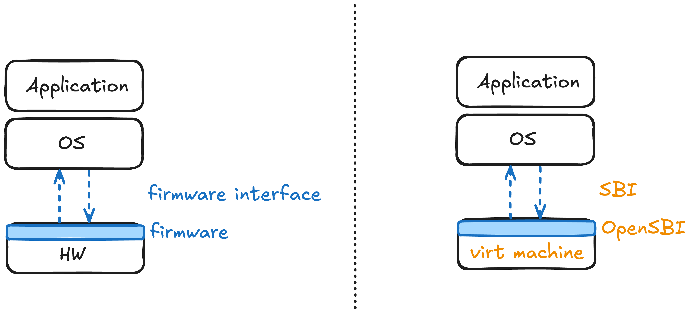
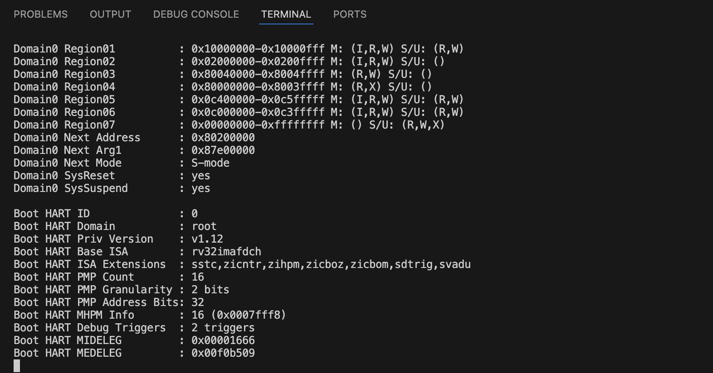

# 커널 부팅 과정

# 1. Booting

<br>

📌 PC 환경에서의 부팅 과정

1️⃣ 전원 공급 및 CPU 초기화

2️⃣ 펌웨어 실행 (ex. BIOS)

- BIOS: HW 초기화 후 부팅 가능한 장치를 탐색하여 OS를 로드

3️⃣ OS 로드 및 실행

<br>

📌 펌웨어(firmware)

- HW에 내장되어 HW를 제어하고 동작을 관리하는 SW
- HW의 비휘발성 메모리에 저장되어 있음

<br>

📌 QEMU의 `virt` 머신 환경에서의 부팅 과정

1️⃣ QEMU virt 머신 시작

2️⃣ OpenSBI 실행

3️⃣ 운영체제 로드 및 실행

<br>



<br>

# 2. OpenSBI 부팅 실습

<br>

🧑‍💻 `run.sh`

- QEMU의 virt 머신, OpenSBI를 사용해서 RISC-V 32비트 가상 머신을 실행하는 스크립트

```bash
#!/bin/bash
# 이 스크립트가 Bash 셸에서 실행되어야 함을 지정
set -xue

# QEMU 실행 파일 경로
QEMU=qemu-system-riscv32

# QEMU 실행
$QEMU -machine virt -bios default -nographic -serial mon:stdio --no-reboot
```

<br>

🧑‍💻 실행 결과

- OpenSBI가 버전 정보, 플랫폼 이름, 제공 기능, HART(코어) 수 등을 출력

<br>

```bash
+ QEMU=qemu-system-riscv32
+ qemu-system-riscv32 -machine virt -bios default -nographic -serial mon:stdio --no-reboot

OpenSBI v1.5.1
   ____                    _____ ____ _____
  / __ \                  / ____|  _ \_   _|
 | |  | |_ __   ___ _ __ | (___ | |_) || |
 | |  | | '_ \ / _ \ '_ \ \___ \|  _ < | |
 | |__| | |_) |  __/ | | |____) | |_) || |_
  \____/| .__/ \___|_| |_|_____/|____/_____|
        | |
        |_|

Platform Name             : riscv-virtio,qemu
Platform Features         : medeleg
Platform HART Count       : 1
...

```

<br>

> 현재까지 과정은 다음과 같음 <p>
> 1️⃣ 가상 컴퓨터의 전원 ON <br>
> 2️⃣ 펌웨어(OpenSBI)에 의한 HW 초기화

<br>

# 3. **링커 스크립트(Linker Script)**

<br>

📌 링커 스크립트

- 컴파일된 코드와 데이터를 메모리 배치를 정의하는 파일
- 커널(kernel.c)을 컴파일한 후 이를 메모리의 정확한 위치에 배치하는 스크립트
- 이는 PC 환경에서 부팅 시 부트로더의 역할

<br>

📌 부트로더

- 커널을 메모리의 올바른 위치에 로드함

<br>

🧑‍💻 `kernel.ld`(링커스크립트)

- `boot` 함수를 진입점으로 지정
- 베이스 주소(base address)는 0x80200000으로 설정
- `.text.boot` 섹션을 가장 앞에 둠
- 각 섹션을 `.text`, `.rodata`, `.data`, `.bss`. 순서대로 배치
- `.bss` 이후에 커널 스택을 배치하고, 크기는 128KB로 설정

```bash
ENTRY(boot)

SECTIONS {
    . = 0x80200000;

    .text :{
        KEEP(*(.text.boot));
        *(.text .text.*);
    }

    .rodata : ALIGN(4) {
        *(.rodata .rodata.*);
    }

    .data : ALIGN(4) {
        *(.data .data.*);
    }

    .bss : ALIGN(4) {
        __bss = .;
        *(.bss .bss.* .sbss .sbss.*);
        __bss_end = .;
    }

    . = ALIGN(4);
    . += 128 * 1024; /* 128KB */
    __stack_top = .;
}
```

<br>

📌 섹션

| **섹션**  | 저장되는 것                            |
| --------- | -------------------------------------- |
| `.text`   | 프로그램의 코드(함수 등)               |
| `.rodata` | 읽기 전용 상수 데이터                  |
| `.data`   | 읽기/쓰기가 가능한 데이터              |
| `.bss`    | 초기값이 0인 읽기/쓰기가 가능한 데이터 |

<br>

# 4. **최소화된 커널**

<br>

🧑‍💻 `kernel.c`

<details>

```c
typedef unsigned char uint8_t;
typedef unsigned int uint32_t;
typedef uint32_t size_t;

extern char __bss[], __bss_end[], __stack_top[];

void *memset(void *buf, char c, size_t n) {
    uint8_t *p = (uint8_t *) buf;
    while (n--)
        *p++ = c;
    return buf;
}

void kernel_main(void) {
    memset(__bss, 0, (size_t) __bss_end - (size_t) __bss);

    for (;;);
}

__attribute__((section(".text.boot")))
__attribute__((naked))
void boot(void) {
    __asm__ __volatile__(
        "mv sp, %[stack_top]\n" // Set the stack pointer
        "j kernel_main\n"       // Jump to the kernel main function
        :
        : [stack_top] "r" (__stack_top) // Pass the stack top address as %[stack_top]
    );
}
```

  </details>

<br>

`🔍 boot` 함수

- 시스템 부팅 시 가장 먼저 실행되는 함수로, 초기 설정을 담당

```c
__attribute__((section(".text.boot")))
__attribute__((naked))
void boot(void) {
    __asm__ __volatile__(
        "mv sp, %[stack_top]\n" // 스택포인터 설정
        "j kernel_main\n" // kernel_main 함수로 점프
        :
        : [stack_top] "r" (__stack_top)
    );
}
```

<br>

🔍 `kernel_main` 함수

- 커널의 주요 진입점으로, 시스템 초기화를 담당

```c
void kernel_main(void) {
    memset(__bss, 0, (size_t) (__bss_end - __bss)); // bss 섹션 초기화
    for (;;); // 무한루프(커널이 종료되지 않도록)
}
```

<br>

🧐 `.bss` 섹션만 초기화하는 이유

- 커널 메모리는 `.bss` 외에도 `.text`, `.data`, `.rodata` 등 여러 섹션으로 구성되어 있음
  → 그런데 `.bss` 섹션만 초기화하는 이유

1. `.bss` 섹션의 특성
   - `.bss` 섹션은 `초기화되지 않은 전역 변수와 정적 변수`를 저장하는 영역
     → ∴ 시스템이 시작될 때 이 섹션의 모든 값을 0으로 설정하여 예측 가능한 상태로 만들어야 함
2. 다른 섹션은 초기화가 따로 필요 없음

   | **섹션**  | 저장되는 것                                      |
   | --------- | ------------------------------------------------ |
   | `.text`   | 프로그램의 코드(함수 등)                         |
   | `.data`   | 읽기/쓰기가 가능한 데이터(컴파일 시 초기값 존재) |
   | `.rodata` | 읽기 전용 상수 데이터                            |

<br>

📌 kernel.c 동작 요약

1️⃣ `boot` 함수 실행

- 스택 포인터 초기화(`kernel_main`도 함수이므로, 함수가 호출되기 전에 스택 포인터가 초기화)

2️⃣ `kernel_main` 함수 실행

- `.bss` 섹션 초기화 : 커널 동작 전, 시스템의 메모리 상태를 신뢰하기 위해

<br>

# 5. 커널 실행하기

<br>

📌 기존 `run.sh`

> 1️⃣ 가상 컴퓨터의 전원 ON
> 2️⃣ 펌웨어(OpenSBI)에 의한 HW 초기화

📌 수정된 `run.sh`

> 1️⃣ 가상 컴퓨터의 전원 ON
> 2️⃣ 펌웨어(OpenSBI)에 의한 HW 초기화
> 3️⃣ 커널 이미지 생성 후, QEMU로 커널을 메모리에 로드

📌 run.sh 스크립트 수정

```bash
#!/bin/bash
set -xue

QEMU=qemu-system-riscv32

# clang 경로와 컴파일 옵션
CC=/opt/homebrew/opt/llvm/bin/clang  # Ubuntu 등 환경에 따라 경로 조정: CC=clang
CFLAGS="-std=c11 -O2 -g3 -Wall -Wextra --target=riscv32-unknown-elf -fno-stack-protector -ffreestanding -nostdlib"

# 커널 빌드
$CC $CFLAGS -Wl,-Tkernel.ld -Wl,-Map=kernel.map -o kernel.elf \
    kernel.c

# QEMU 실행
$QEMU -machine virt -bios default -nographic -serial mon:stdio --no-reboot \
    -kernel kernel.elf
```

🧑‍💻 실행 결과

- 아무 변화가 없음 → ∵ 커널 무한루프



<br>

# 6. 커널 디버깅

> ☑️ 레지스터 중 Program Counter 값을 확인해서 현재 실행 중인 코드 확인 <br>
> ☑️ 레지스터 중 Stack Pointer 값을 확인해서 스택이 정의한대로 초기화됐는지 확인

<br>

📌 레지스터 정보 확인

- CPU 레지스터 정보 확인

```
QEMU 9.2.1 monitor - type 'help' for more information
(qemu) info registers
```

- CPU 레지스터 정보
    <details>
        <summary>상세 코드</summary>

        CPU#0
        V      =   0
        pc       80200048
        mhartid  00000000
        mstatus  80006080
        mstatush 00000000
        hstatus  00000000
        vsstatus 00000000
        mip      00000000
        mie      00000008
        mideleg  00001666
        hideleg  00000000
        medeleg  00f0b509
        hedeleg  00000000
        mtvec    800004e0
        stvec    80200000
        vstvec   00000000
        mepc     80200000
        sepc     00000000
        vsepc    00000000
        mcause   00000003
        scause   00000000
        vscause  00000000
        mtval    80010724
        stval    00000000
        htval    00000000
        mtval2   00000000
        mscratch 80046000
        sscratch 00000000
        satp     00000000
        x0/zero  00000000 x1/ra    8000e63e x2/sp    8022004c x3/gp    00000000
        x4/tp    80046000 x5/t0    00000001 x6/t1    00000002 x7/t2    00001000
        x8/s0    80045f40 x9/s1    00000001 x10/a0   8020004c x11/a1   8020004c
        x12/a2   00000000 x13/a3   00000019 x14/a4   00000000 x15/a5   00000001
        x16/a6   00000001 x17/a7   00000005 x18/s2   80200000 x19/s3   00000000
        x20/s4   87e00000 x21/s5   00000000 x22/s6   80006800 x23/s7   00000001
        x24/s8   00002000 x25/s9   80042308 x26/s10  00000000 x27/s11  00000000
        x28/t3   80020ad1 x29/t4   80045f40 x30/t5   000000b4 x31/t6   00000000
        fcsr     00000000
        f0/ft0   ffffffff00000000 f1/ft1   ffffffff00000000 f2/ft2   ffffffff00000000 f3/ft3   ffffffff00000000
        f4/ft4   ffffffff00000000 f5/ft5   ffffffff00000000 f6/ft6   ffffffff00000000 f7/ft7   ffffffff00000000
        f8/fs0   ffffffff00000000 f9/fs1   ffffffff00000000 f10/fa0  ffffffff00000000 f11/fa1  ffffffff00000000
        f12/fa2  ffffffff00000000 f13/fa3  ffffffff00000000 f14/fa4  ffffffff00000000 f15/fa5  ffffffff00000000
        f16/fa6  ffffffff00000000 f17/fa7  ffffffff00000000 f18/fs2  ffffffff00000000 f19/fs3  ffffffff00000000
        f20/fs4  ffffffff00000000 f21/fs5  ffffffff00000000 f22/fs6  ffffffff00000000 f23/fs7  ffffffff00000000
        f24/fs8  ffffffff00000000 f25/fs9  ffffffff00000000 f26/fs10 ffffffff00000000 f27/fs11 ffffffff00000000
        f28/ft8  ffffffff00000000 f29/ft9  ffffffff00000000 f30/ft10 ffffffff00000000 f31/ft11 ffffffff00000000

  </details>

→ `pc 80200048` 는 현재 `0x80200048` 주소의 명령어가 실행되고 있음을 의미

<br>

📌 실행 파일 분석

```bash
$ llvm-objdump -d kernel.elf
```

- 실행결과
  <details>

  ```bash

  kernel.elf:     file format elf32-littleriscv

  Disassembly of section .text:

  80200000 <boot>:    # boot function
  80200000: 80220537      lui     a0, 0x80220
  80200004: 04c50513      addi    a0, a0, 0x4c
  80200008: 812a          mv      sp, a0
  8020000a: 01a0006f      j       0x80200024 <kernel_main>

  8020000e <memset>:    # memset function
  8020000e: ca11          beqz    a2, 0x80200022 <memset+0x14>
  80200010: 962a          add     a2, a2, a0
  80200012: 86aa          mv      a3, a0
  80200014: 00168713      addi    a4, a3, 0x1
  80200018: 00b68023      sb      a1, 0x0(a3)
  8020001c: 86ba          mv      a3, a4
  8020001e: fec71be3      bne     a4, a2, 0x80200014 <memset+0x6>
  80200022: 8082          ret

  80200024 <kernel_main>:    # kernel_main function
  80200024: 802005b7      lui     a1, 0x80200
  80200028: 04c58593      addi    a1, a1, 0x4c
  8020002c: 80200537      lui     a0, 0x80200
  80200030: 04c50513      addi    a0, a0, 0x4c
  80200034: 40b50633      sub     a2, a0, a1
  80200038: ca01          beqz    a2, 0x80200048 <kernel_main+0x24>
  8020003a: 00158613      addi    a2, a1, 0x1
  8020003e: 00058023      sb      zero, 0x0(a1)
  80200042: 85b2          mv      a1, a2
  80200044: fea61be3      bne     a2, a0, 0x8020003a <kernel_main+0x16>
  80200048: a001          j       0x80200048 <kernel_main+0x24>.   # <- PC 값 80200048
  ```

  </details>

<br>

🧑‍💻 현재 프로그램의 상태 확인 : 무한루프

- CPU 레지스터 정보에서 `pc 80200048`
- 실행파일 분석 결과 `j 0x80200048 <kernel_main+0x24>`
  - 자기 자신의 주소로 점프하고 있음
  - 무한 루프를 의미
  ```
  80200048: a001          j       0x80200048 <kernel_main+0x24>.
  ```

<br>

🧑‍💻 스택 포인터 값 확인

- 스택 포인터(sp)는 현재 스택의 최상위 주소
- sp가 링커 스크립트에서 정의한 \_\_stack_top 주소로 설정되었는지 확인할 수 있음
- CPU 레지스터 정보
  ```
  x2/sp 8022004c
  ```
  → sp가 `8022004c` 로 설정됨
- 이를 `kernel.map` 에서 확인(커널의 실제 메모리 배치)

  - `__stack_top` 주소도 `8022004c`로 일치
  - 파일 상세
    <details>

            VMA      LMA     Size Align Out     In      Symbol
            0        0 80200000     1 . = 0x80200000
        80200000 80200000       4a     2 .text
        ...
        8020004c 8020004c        0     4 .bss
        8020004c 8020004c        0     1         __bss = .
        8020004c 8020004c        0     1         __bss_end = .
        8020004c 8020004c        0     1 . = ALIGN ( 4 )
        8020004c 8020004c    20000     1 . += 128 * 1024
        8022004c 8022004c        0     1 __stack_top = .

    </details>

> 결론 : 정의한 커널이 메모리에 로드되어 제대로 동작하고 있음
