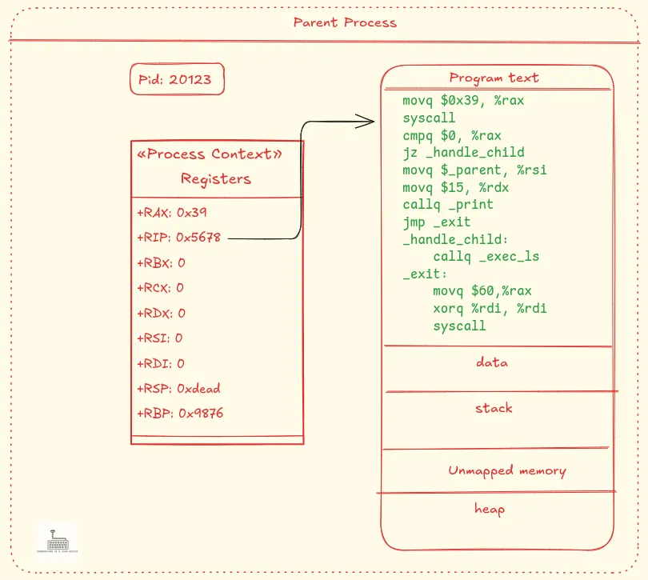
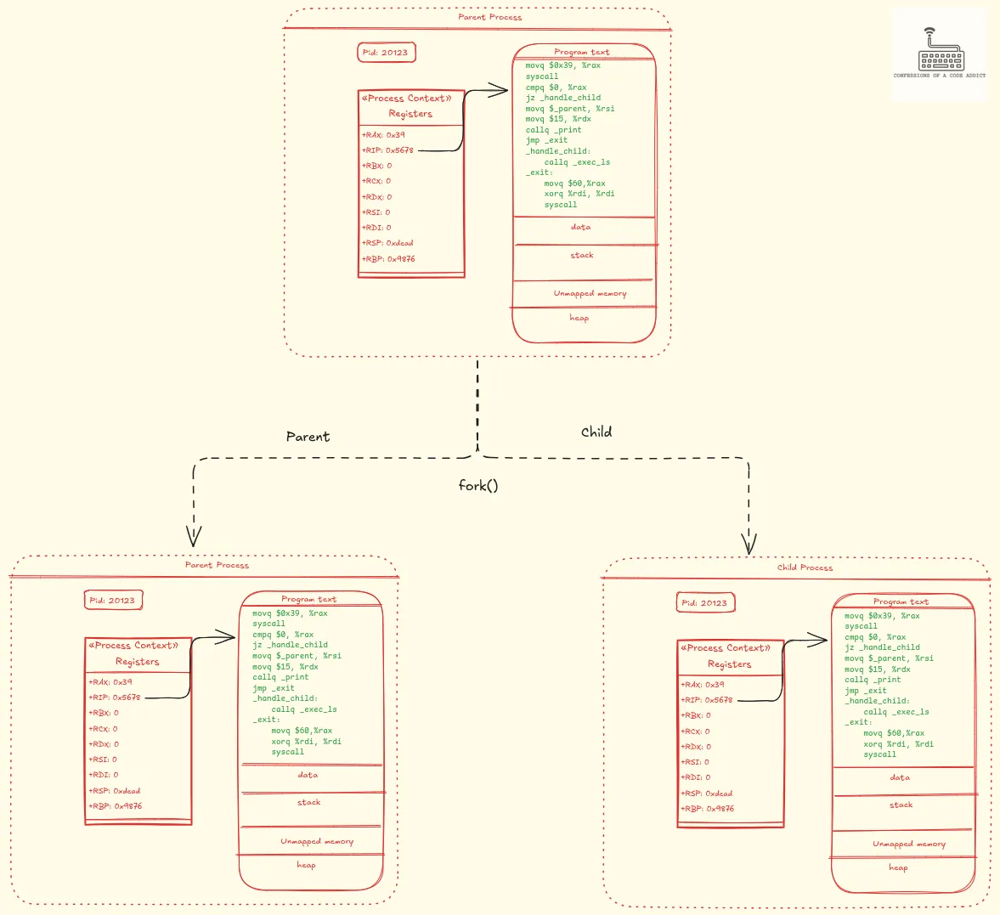
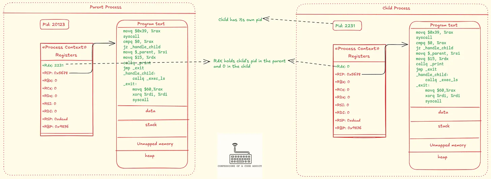

# fork()

# 1. Introduction

📌 `fork()` 시스템 콜

- UNIX 계열 OS에서 새 프로세스를 생성할 때 사용하는 시스템 콜
  - 부모 프로세스를 복사해서 자식 프로세스를 생성
- 시스템 콜이 실행되면 CPU 제어권이 커널로 넘어감
- 시스템 콜이 끝나고 다시 사용자 프로그램으로 CPU 제어권이 왔을 때, 현재 자신이 자식인지 부모인지 확인하려면 반드시 `fork()`의 반환값을 체크해야함

📌 예제

- 이 예제에서 자식 프로세스는 `execve` 시스템 콜을 호출해 `ls` 프로그램을 실행하고, 부모 프로세스는 표준 에러(stderr)에 메시지를 출력한 후 종료
- 코드 : `fork.c`

  ```c
  #include <signal.h>
  #include <stdint.h>
  #include <stdio.h>
  #include <stdlib.h>
  #include <unistd.h>
  #include <sys/types.h>
  #include <sys/wait.h>

  extern char **environ; // Use the existing environment

  int main(void) {
  		// fork()로 부모 프로세스 복제
  		// 부모 프로세스는 자식 프로세스의 PID를 반환받고
  		// 자식 프로세스는 0을 반환받음
      pid_t pid = fork();

  		// 자식 프로세스의 경우, execve 명령어로 /usr/bin/ls 프로그램을 실행
      if (pid == 0) {
          // Child process: execute "ls"
          char *ls_args[] = {"ls", NULL};
          execve("/usr/bin/ls", ls_args, environ);

          // If execve fails
          perror("execve failed");
          exit(EXIT_FAILURE);
      }
      // 부모 프로세스의 경우, 자식 프로세스가 프로그램 실행을 완료하고 종료할 때까지 대기한 뒤 자신도 종료
      else {
          // Parent process
          fprintf(stderr, "%s\n", "Parent process");

          // Wait for the child process to finish
          if (wait(NULL) == -1) {
              perror("wait failed");
          }

          exit(EXIT_SUCCESS);
      }
  }
  ```

- 흐름 요약
  ```
  부모 프로세스
  │
  ├─ fork() ─→ 부모 (pid 반환) ── 자식 기다림 ── 자식 종료 확인 → 종료
  │                 ↘
  │                 자식 프로세스(pid = 0 반환)
  │                 execve("/usr/bin/ls") 호출 → "ls" 실행
  ```

🧐 이때, 하나의 시스템 콜이 어떻게 두 개의 반환값을 갖는가?

- 부모 프로세스, 자식 프로세스에 따라 반환값을 다르게 가짐
  → 이 반환값에 따라 if 조건문의 분기로 나뉘어 실행됨

# 2. System Call Calling Convention

📌 fork() 함수와 Calling convention

- fork() 함수도 결국 커널이 제공하는 시스템 콜을 감싼 wrapper 함수임
- 따라서 사용자 프로그램이 직접 커널을 호출하기 위해선 어셈블리 명령어를 사용해야 함
- 이 과정은 calling convention에 따라 이루어짐

📌 Calling convention이란

- 커널에 어떤 시스템 콜을 실행할 것인지 전달하는 규칙
- 인자를 전달하는 규칙
- 사용자 공간으로 시스템 콜의 반환 값을 전달하는 규칙

📌 X86 아키텍처에서 리눅스 커널의 Calling convention

- `RAX` 레지스터에 시스템 콜 번호를 넣기 ⇒ 실행할 시스템 콜 지정
  → 커널 내부에 `번호:시스템콜`을 매핑한 테이블이 있음
- 최대 6개 인자 전달 가능
  - 전달 순서 : `RDI, RSI, RDX, R10, R8, R9`
- 시스템 콜의 반환값은 RAX 레지스터에 저장

📌 `syscall` 명령어

- Calling convention에 따라 레지스터를 설정한 후 `syscall` 명령어 호출
- 그러면 커널에게 제어권이 넘어감(`trap` 발생)
- 예시 : `exit()` 시스템 콜

```nasm
movq $0x3c, %rax   ; exit 시스템 콜 번호는 0x3c, 이를 rax 레지스터에 넣음
movq $0, %rdi      ; 종료 상태(status)를 0으로 지정
syscall            ; syscall 호출로 커널 실행
```

# **3. fork.c의 구현**

> 위에서 봤던 예제(`fork.c`)를 어셈블리로 변환한 코드

✅ 중요 포인트

- 시스템 콜의 반환값이 커널에 의해 `rax` 레지스터에 기록됨
- 따라서 시스템 콜 명령어(`syscall`) 직후에는 이 값에 따라 분기
- `fork()`의 경우 프로세스의 `rax` 레지스터
  - 부모 프로세스 : 자식 프로세스의 PID가 있음
  - 자식 프로세스 : 0

1️⃣ `fork()` 시스템 콜 호출

- 코드 : `fork.c`

  ```c
  ...

  int main(void) {
      pid_t pid = fork();
  ```

```nasm
_start:
    movq $0x39, %rax ; fork 시스템 콜 번호(0x39)
    syscall
```

- 프로그램은 `fork` 시스템 콜을 실행하면서 시작
- 이를 위해 `rax` 레지스터에 fork의 시스템 콜 번호(`0x39`) 를 저장한 후, `syscall` 명령어를 실행

2️⃣ 시스템 콜의 반환값을 0과 비교

```nasm
cmpq $0, %rax     ; 반환값(%rax)을 0과 비교
jz _handle_child  ; 0이면 _handle_child로 점프
```

- 시스템 콜(`syscall`)이 실행된 후에는 반환값이 `rax` 레지스터에 저장됨
- 이제 현재 실행 중인 프로세스가 자식인지 부모인지를 판단하기 위해 이 값을 `0`과 비교해야 함
  - 이 비교는 `cmpq` 명령어를 통해 이루어짐
- `cmpq` 명령어는 비교의 결과에 따라 플래그 레지스터(flags register) 의 값을 업데이트하는 방식으로 동작
- 여기서는 오직 Zero Flag(ZF) 가 설정되었는지의 여부만 중요
- ZF가 설정되었는지 여부에 따라 분기를 수행하는 명령어가 바로 `jz`(jump-if-zero)
- 이 명령어는 ZF가 설정된 경우(즉, 비교 결과가 같으면) 지정된 라벨(label)로 점프

3️⃣ 자식 프로세스의 코드 실행

```nasm
_handle_child:
    callq _exec_ls ; _exec_ls 함수 호출
```

- `_handle_child` 라벨은 `_exec_ls`라는 함수를 호출
- 이 함수는 다시 `execve` 시스템 콜을 호출하여, 현재의 프로세스 이미지를 `ls` 프로그램으로 교체

4️⃣ 부모 프로세스의 코드 실행

```nasm
movq $_parent, %rsi ; 메시지가 저장된 버퍼 주소
movq $15, %rdx      ; 버퍼의 길이(15 바이트)
callq _print        ; stderr에 메시지 출력
jmp _exit           ; 종료
```

- 반면, `rax` 값이 0이 아니라면 현재 실행 중인 프로세스는 부모 프로세스
- 이때는 위의 점프 명령(`jz`)을 수행하지 않고, 그대로 다음 명령어로 내려가서 부모 프로세스의 코드를 실행
- 이 예시에서 부모 프로세스는 표준 에러(stderr)에 메시지를 출력한 뒤 종료
- 이를 위해 `_print` 함수를 호출하여 stderr에 메시지를 출력한 후 `_exit` 라벨로 점프하여 종료를 수행

# 4. 커널 내부에서 동작

📌 fork.c는 응용 프로그램 → 즉, 사용자 공간(user space)에서 `fork` 함수 동작

- 이제는 커널 공간(kernel space)에서 fork 함수가 어떻게 동작하는지 살펴볼 것

## 4.1 **fork를 호출하기 직전의 부모 프로세스 상태**

📌 fork 시스템 콜을 실행하기 직전의 부모 프로세스 상태

- 메모리 세그먼트와 프로세스 컨텍스트와 같은 주요 요소만 표현
  

✅ 그림에서 확인할 것

- 프로세스는 그림보다 더 많은 정보가 있지만 생략됨
- 프로세스가 컨텍스트(context)를 갖고 있음
  - 컨텍스트 == 레지스터 값들의 집합
  - `rax` : fork 시스템 콜 번호(0x39)를 갖고 있음
  - `rip` : 명령어 포인터, 즉 다음에 실행할 명령어의 주소(여기선 `syscall`을 가리킴)

## 4.2 부모 프로세스의 복제 (Duplicating the Parent Process)

- fork 시스템 콜이 호출되면 ⇒ 커널은 부모 프로세스를 복제함
  - 즉, `rax`에 `0x39`가 있는 상태에서 `syscall` 명령어가 호출되면 ⇒ 커널은 부모 프로세스를 복제함
  - 거의 모든 정보가 복사됨
    → 프로세스 객체(process object), 컨텍스트(context), 주소 공간(address space), 열린 파일 디스크립터(open file descriptor) 테이블, 메모리 매핑(memory mappings) 등

📌 부모 프로세스를 복제한 직후의 상황



- 동일한 코드 영역(실행 가능한 코드)
- 동일한 레지스터 값들(context)
  - 특히 `rip` 값도 사용자 공간으로 돌아갔을 때 실행할 명령어인 `cmpq $0, %rax`의 주소를 가리킴

📌 추가적으로 몇 가지 작업

- 자식 프로세스의 PID를 새로 할당
- PPID, CPID 값 변경 등

## 4.3 반환값 설정 및 유저 공간으로의 복귀

📌 fork 의 반환값

- 표준 : 부모 프로세스는 자식의 PID를 반환하고, 자식 프로세스는 0을 반환
- X86 리눅스의 경우, `syscall`의 반환값은 `rax` 레지스터에 저장됨
  → ∴ 부모의 `rax`에는 자식 PID, 자식의 `rax`에는 0을 설정해야함
- 부모 프로세스는 직접 `syscall`을 호출했으므로, 커널이 부모의 `rax`에 자식 PID를 설정하는 것이 정상적인 `fork`의 흐름
- 그러나 자식 프로세스는 직접 `syscall`을 호출하지 않았으므로, 커널이 자식 프로세스의 `rax`를 명시적으로 `0`으로 설정 후 자식 프로세스를 실행 대기 큐에 넣음

📌 fork가 반환되기 직전, 부모와 자식 프로세스의 상태



- 자식 프로세스
  - 새로운 PID를 받음
  - 커널이 `rax`를 `0`으로 설정
- 부모 프로세스
  - `rax`는 자식의 PID로 설정
- 부모와 자식이 서로 다른 `rax` 값을 갖게 돼서 fork의 반환값이 2개인 것

# 5. 리눅스 커널의 fork

📌 자식 프로세스의 `rax` 레지스터를 `0`으로 설정

```c
childregs = task_pt_regs(p);
...
*childregs = *current_pt_regs(); // 부모의 현재 레지스터 상태를 자식에게 복사
childregs->ax = 0;  // 자식 프로세스의 rax (ax)에 0을 설정
```

[https://github.com/torvalds/linux/blob/80e54e84911a923c40d7bee33a34c1b4be148d7a/arch/x86/kernel/process.c#L233](https://github.com/torvalds/linux/blob/80e54e84911a923c40d7bee33a34c1b4be148d7a/arch/x86/kernel/process.c#L233)
