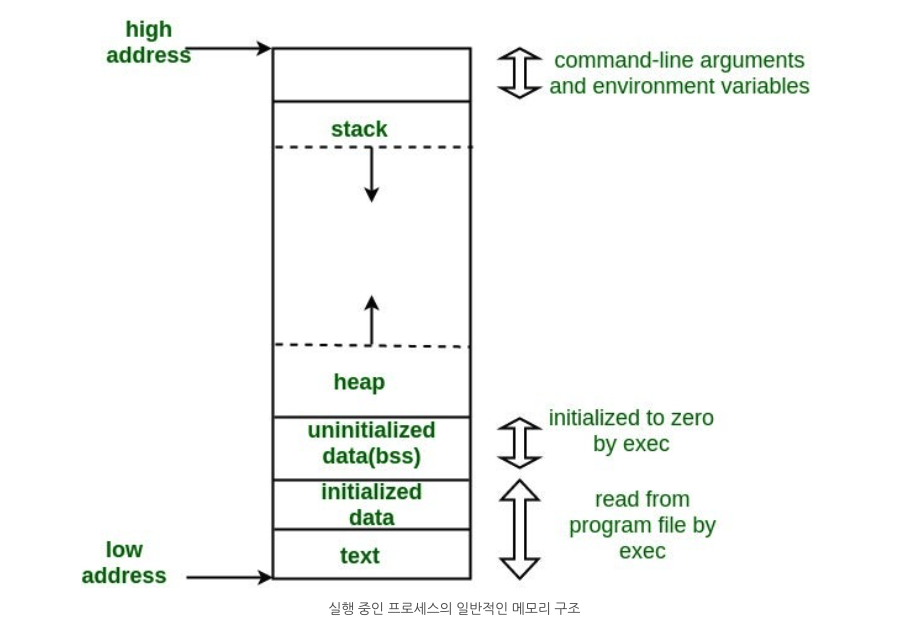

# Memory Layout in C

📌 프로그램의 메모리 세그먼트 구조

- Code(text), Data(data, bss), Stack, Heap

📌 프로그램이 저장되는 메모리 공간

- 프로그램을 실행하려면 CPU는 보조기억장치(HDD, SDD)에 있는 프로그램을 읽어서 RAM에 로드해야함
- 이때, 프로그램이 저장되는 메모리 공간은 일반적으로 Code, Data, Stack, Heap 4가지 세그먼트로 구분됨

📌 세그멘테이션 기법

- 메모리 관리 기법 중 하나
- 프로그램을 여러 세그먼트로 나눠서 각 세그먼트를 독립적으로 관리
- 각 세그먼트는 연속적인 메모리 공간을 차지함

📌 가상 주소(Virtual Address)

- 가상 주소는 `세그먼트 번호:오프셋`으로 표현됨
  → 세그먼트 번호 : 각 세그먼트마다 존재하는 고유한 번호

📌 가상 주소에서 물리 주소(Physical Address) 변환

- 메모리에 로드된 프로그램을 실행하려면 가상 주소를 실제 메모리의 물리 주소로 변환해야함

1. 세그먼트 테이블에서 해당 세그먼트의 시작 주소(base address)와 크기(limit) 조회
2. 가상 주소의 오프셋이 크기(limit)을 초과하면 메모리 접근 오류 발생
3. 세그먼트 시작 주소 + 오프셋으로 물리 주소 계산

📌 세그멘테이션 기법

- 메모리 보호가 쉬움
  → 프로그램이 메모리에 접근할 때 범위(limit)가 정해져 있으므로
- 각 세그먼트는 크기가 서로 다를 수 있음
- 각 세그먼트의 실제 메모리 위치는 프로그램이 실행될 때 결정



### 1. Text Segment(.text) 또는 Code Segment (.code)

- 프로그램의 실행 가능한 명령어(Instruction)가 저장되는 메모리 영역
- 이 영역은 일반적으로 읽기 전용(Read-Only)
  → ∴ 프로그램이 실행 중에 해당 명령어를 변경하지 못하도록 보호
- 텍스트 세그먼트는 힙(Heap)과 스택(Stack) 메모리 공간 아래에 위치하여, 이들에 의해 메모리 공간이 덮어씌워지지 않도록 보호
  → 힙은 낮은 주소에서 높은 주소로, 스택은 높은 주소에서 낮은 주소로 확장됨
  → 텍스트 영역은 그 아래 배치되므로, 힙과 스택이 확장되더라도 텍스트 영역은 침범하지 않음
- 이 영역은 프로세스가 종료될 때까지 유지됨
  → 자주 실행되는 프로그램의 복사본을 메모리에 저장해서 프로세스 간 공유 가능
  → ex. 텍스트 편집기, C 컴파일러, 셸 등

### 2. Data Segment

**2.1 Initialized Data Segment(.data)**

- 초기화된 전역 변수와 정적(static) 변수를 저장하는 메모리 영역

```c
#include <stdio.h>

// 초기화된 전역 변수
int global_var = 10;

// 초기화된 정적 변수
static int static_var = 20;

int main() {
    printf("Global Variable: %d\n", global_var);
    printf("Static Variable: %d\n", static_var);
    return 0;
}
```

- 데이터 세그먼트는 다음과 같이 분류됨
  - 초기화된 읽기-쓰기 영역(Initialized Read-Write Area)
    → 런타임에 변수에 접근해서 값 변경 가능
  - 초기화된 읽기 전용 영역(Initialized Read-Only Area)
    → 런타임 동안 변경 불가
- 예시
  ```c
  const char* str = "hello world";
  ```
  - 문자열 리터럴 `"hello world"` → 초기화된 읽기 전용 영역에 저장
  - 포인터 변수 `str` → 초기화된 읽기-쓰기 영역에 저장

**2.2 Uninitialized Data Segment (.bss)**

- 초기화하지 않은 전역 변수와 정적 변수를 저장하는 영역
- 이 영역은 런타임에 OS에 의해 0으로 초기화됨

- 예시
  - 아래 변수들은 초기값이 명시되지 않았으므로 BSS 영역에 저장되고, 프로그램 실행 시 자동으로 0으로 초기화
  ```c
  int a;
  static int b;
  ```

✅ 초기화된 데이터 영역과 BSS 영역을 구분하는 이유

- 실행 파일 크기 최적화
  - 초기화된 데이터는 실행 파일에 초기값이 포함됨
  - 그러나 BSS 영역의 데이터는 값이 실행 파일에 포함되지 않으므로 실행 파일의 크기가 줄어듦
- 실팽 파일 크기가 감소하면 저장 공간 효율성 및 메모리 로딩 속도 증가

### **3. Heap**

- 힙 영역은 **동적 메모리 할당(dynamic memory allocation)**에 사용되는 메모리 영역
- BSS 영역의 끝에서 시작하여 높은 메모리 주소 방향으로 확장
- `malloc()`, `realloc()`, `free()` 등의 **동적 메모리 관리 함수**에 의해 관리되며, 내부적으로 `brk` 및 `sbrk` 시스템 호출을 사용하여 크기 조정 가능
- 하나의 프로세스 내에서 **공유 라이브러리와 동적으로 로드되는 모듈**도 이 힙 영역을 공유하여 사용합니다.

📌 **예제**: 아래 변수는 힙 영역에 저장됨

- `malloc()`을 사용하여 힙 영역에서 10개의 `int` 크기만큼 메모리를 할당

```c
int *ptr = (int*) malloc(sizeof(int) * 10);
```

### **4. Stack**

스택은 지역 변수와 함수 호출 관리를 위한 메모리 공간입니다.

- **함수가 호출될 때마다 스택 프레임(stack frame)이 생성**되어, **지역 변수, 함수 매개변수, 반환 주소(return address)** 등을 저장
- **메모리 상에서 높은 주소에서 낮은 주소 방향으로 성장**하며, **힙(Heap)과 반대 방향으로 확장**
- 스택과 힙이 맞닿아 충돌(stack overflow)하면 **프로그램의 가용 메모리가 소진**된 것으로 간주

📌 **예제**: 스택 영역에 저장되는 데이터

```c
void function() {
    int local_var = 10;  // 지역 변수는 스택에 저장됨
}
```

# 예제 코드의 메모리 배치 확인

- `binutils` 설치

  - GNU에서 제공하는 바이너리 유틸리티 모음
  - 어셈블러, 링커, 객체 덤프 등 도구가 있음

  ```
  brew install binutils
  ```

- `gsize` 명령어를 사용하여 실행 파일의 **텍스트(.text), 데이터(.data), BSS 영역(.bss)의 크기**를 확인 가능

**1️⃣ 간단한 C 프로그램 실행 파일 크기 확인**

```c
#include <stdio.h>

int main() {
    return 0;
}
```

```
gcc memory-layout.c -o memory-layout
gsize memory-layout
```

출력 결과:

```c
   text    data     bss     dec     hex filename
    108       0       0     108      6c memory-layout
```

| text     | Text Segment                  |
| -------- | ----------------------------- |
| data     | Initialized Data Segment      |
| bss      | Uninitialized Data Segment    |
| dec      | text + data + bss             |
| 10진수   |
| hex      | dec 값과 동일한 크기의 16진수 |
| filename | 분석한 실행 파일의 파일명     |

> 현재 변수가 없고 실행 가능한 코드만 있음

**2️⃣ 전역 변수 추가 후 BSS 크기 증가 확인**

```c
#include <stdio.h>

// 초기화되지 않은 전역 변수 (BSS 영역에 저장)
int global;
int main() {
    return 0;
}
```

출력 결과:

```
   text    data     bss     dec     hex filename
    108       0       4     112      70 memory-layout
```

> 초기화되지 않은 전역 변수 추가
> ∴ `bss` 0B → 4B

**3️⃣ 정적(static) 변수 추가 후 BSS 크기 증가**

```c
#include <stdio.h>

// 초기화되지 않은 전역 변수 (BSS)
int global;
int main() {
    // 초기화되지 않은 정적 변수 (BSS)
    static int i;
    return 0;
}
```

출력 결과:

```
   text    data     bss     dec     hex filename
    108       0       8     116      74 memory-layout
```

> 초기화되지 않은 정적 변수 추가
> ∴ `bss` 4B → 8B

**4️⃣ 정적 변수에 초기값을 할당하면 `.data` 영역으로 이동**

정적 변수 `i`가 초기화되면, `.bss`가 아니라 **`.data`(초기화된 데이터 영역)**에 저장됩니다.

이에 따라 `.data` 크기가 증가하고 `.bss` 크기는 줄어듭니다. (`data: 248 → 252`, `bss: 16 → 12`)

```c
#include <stdio.h>

// 초기화되지 않은 전역 변수 (BSS)
int global;
int main(void) {
    // 초기화된 정적 변수 (Data Segment)
    static int i = 100;
    return 0;
}

```

출력 결과:

```
   text    data     bss     dec     hex filename
    108       4       4     116      74 memory-layout
```

> 정적변수를 초기화하니 `data` 영역에 값이 증가함(data 0B → 4B)
> → `bss` 영역의 값은 감소함(8B → 4B)

# BSS

- bss 영역과 data 영역을 분리하는 이유 : 실행 파일 크기 최적화
- 그러나 gsize 명령어로 확인해보면, 둘의 dec 값은 116B로 똑같음

- data 영역의 값은 실행 파일 안에 포함됨
- bss 영역의 값은 실행 파일 안에 포함되지 않음
- 위 예제에서 bss 8B는 8B 크기의 변수가 있다는 크기 정보만 기록되고 실제 데이터는 실행 파일에 포함되지 않음

  → ∴ 실행 파일의 크기 감소

- 실제 실행 파일의 크기 확인

  - 파일 1

  ```
     text    data     bss     dec     hex filename
      108       4       4     116      74 memory-layout
  ```

  ```bash
  $ ls -lh memory-layout # 33K
  ```

  - 파일 2

  ```
     text    data     bss     dec     hex filename
      108       0       8     116      74 memory-layout
  ```

  ```bash
  $ ls -lh memory-layout # 17K
  ```

- 실제 실행 파일의 크기는 116B가 아닌 훨씬 큰 크기(33KB 또는 17KB)
- gsize 명령어는 섹션 크기만 보여줌
- 실제 실행 파일에는 섹션 정보 이외에도
  - 실행 파일 헤더, 심볼 정보, 디버그 정보, 패딩 등이 포함됨
- 따라서 bss 영역에 값을 저장하면 초기값을 저장하지 않아서 실행 파일의 크기가 최적화됨
